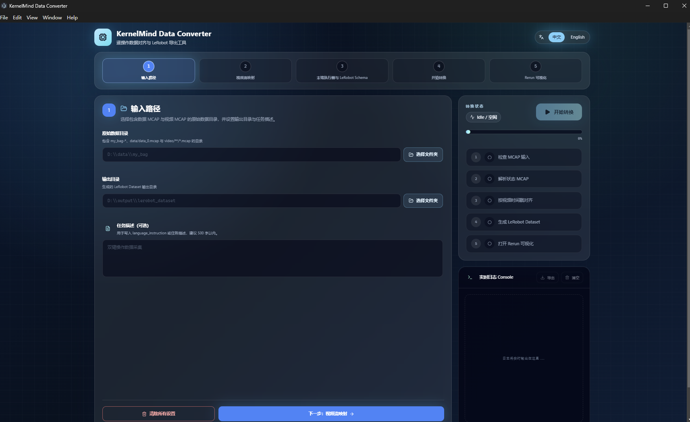
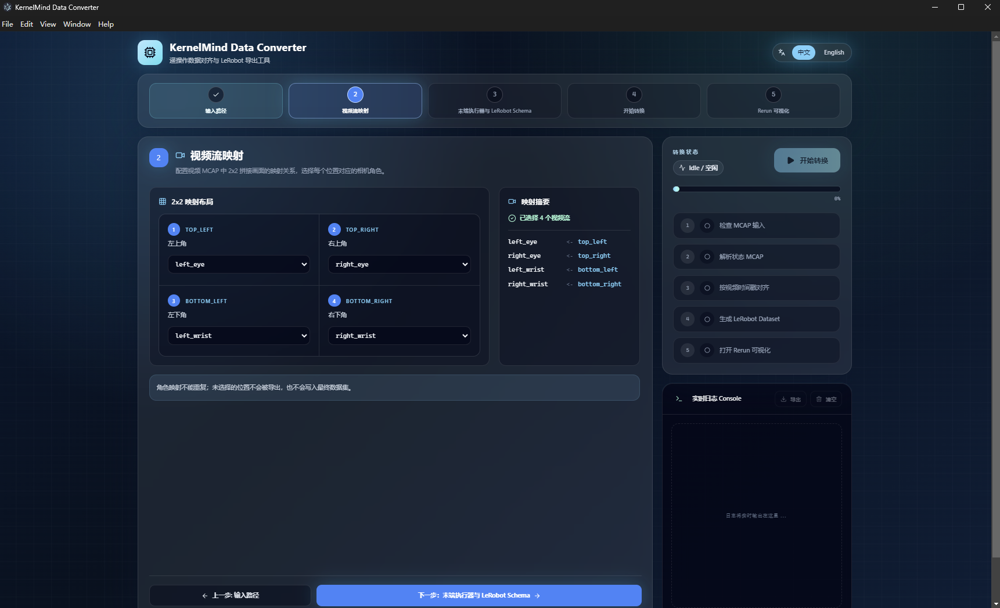
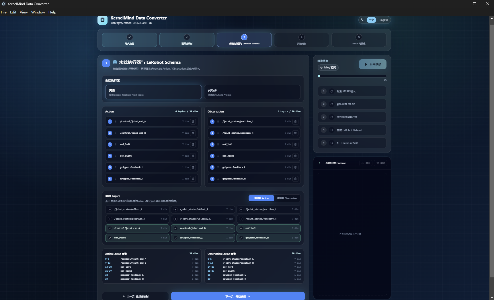
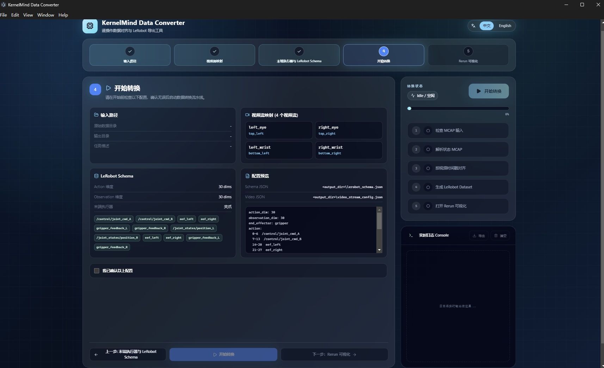
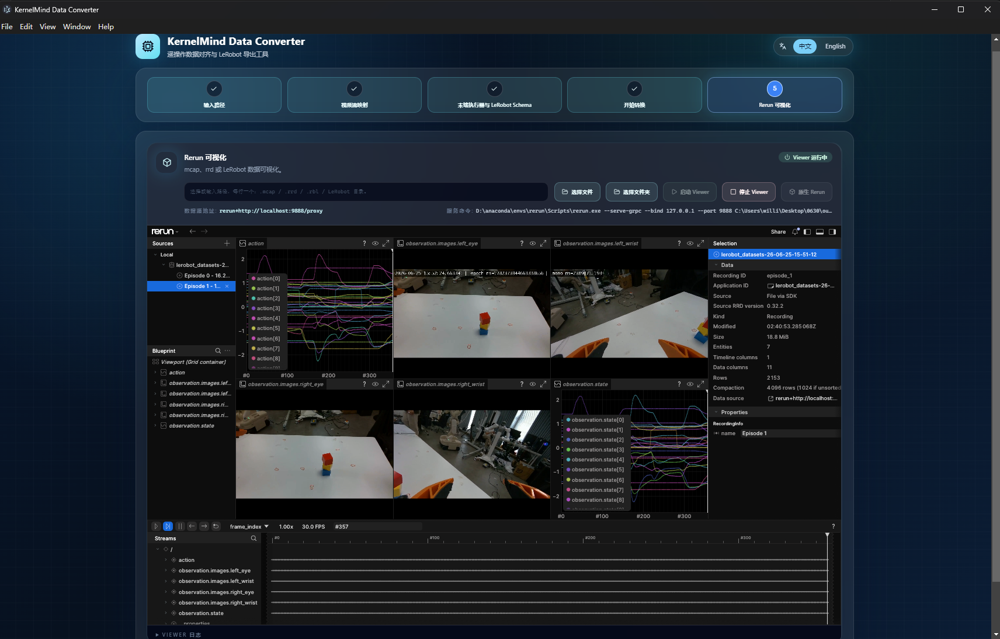

# Data-Processing-Tool 使用说明

Data-Processing-Tool 是面向 Apex 遥操作数据的 Windows 桌面工具，用于检查双 MCAP 录制数据、配置视频流和机器人字段，并导出 LeRobot v3 数据集。软件以 Windows `.exe` 安装包交付，安装包已包含运行环境，客户无需另行安装 Python、Conda 或 Node.js。

项目仓库：[Gento-Teleoperation-Apex/Data-Processing-Tool](https://github.com/Gento-Teleoperation-Apex/Data-Processing-Tool)

## 1. 下载与安装

1. 打开项目仓库的 [Releases](https://github.com/Gento-Teleoperation-Apex/Data-Processing-Tool/releases) 页面。
2. 下载最新 Windows x64 安装包，例如 `Data-Processing-Tools-<version>-Setup.exe`。
3. 双击安装包并按提示完成安装，然后从桌面或开始菜单启动 Data-Processing-Tool。

:::note Windows 安全提示
首版安装包可能未进行代码签名。若 Windows 显示“未知发布者”，请先确认文件来自上述官方仓库，再选择“更多信息”并继续运行。
:::

## 2. 双 MCAP 数据格式

每个 episode 需要同时包含状态 MCAP 和视频 MCAP：

```text
BAG_STORAGE/
  recorded_bags/
    my_bag-yy-MM-dd-HH-mm-ss/
      data/
        data_0.mcap
      video/
        record_<timestamp>/
          record_<timestamp>_0.mcap
```

| 文件 | 用途 | 要求 |
|---|---|---|
| `data/data_0.mcap` | 机械臂状态、动作和末端数据 | 每个 episode 一个 |
| `video/**/*.mcap` | 2x2 相机视频流 | 每个 episode 必须且只能有一个 |

新版不再使用 `cameras.mp4` 和 `cameras_first_frame.yaml`。视频 MCAP 的 `log_time` 作为视频主时间线，工具按绝对时间将机器人状态对齐到视频帧，并保留视频原始帧率与全部帧。

## 3. 转换流程

### 3.1 选择输入与输出目录

在“输入路径”中选择包含一个或多个 `my_bag-*` episode 的目录，并设置 LeRobot 数据集输出目录。任务描述可选，建议填写本次采集任务的简短说明。



### 3.2 配置视频流映射

将视频 MCAP 中的 2x2 画面位置映射到对应相机。常用角色为：

- `left_eye`：左目相机
- `right_eye`：右目相机
- `left_wrist`：左腕相机
- `right_wrist`：右腕相机

以实际画面位置为准完成映射，四个角色不能重复。



### 3.3 选择末端执行器与 Schema

选择当前设备使用的末端执行器类型，并检查 Action、Observation 的 Topic、顺序和维度。夹爪与灵巧手对应的字段不同，配置必须与录制数据和后续训练配置保持一致。



### 3.4 检查并开始转换

在“开始转换”页面复核输入路径、视频映射、末端执行器和 Schema。确认无误后勾选确认项并开始转换。右侧状态区显示当前阶段、进度和实时日志，可用于定位输入检查、MCAP 解析、时间戳对齐或数据集生成错误。



### 3.5 查看 Rerun 可视化

转换完成后可进入 Rerun 可视化，检查四路相机、机械臂状态、动作和末端数据是否在时间轴上正确对齐。



## 4. 数据质量检查

Data-Processing-Tool 同时提供数据质量检测模块。建议在批量转换前先检查：

- episode 是否同时包含状态 MCAP 和唯一的视频 MCAP；
- 必需 Topic 是否存在，消息数量是否合理；
- 时间戳是否连续，状态数据能否覆盖视频时间范围；
- 四路相机画面是否完整，映射是否与实际安装位置一致；
- Action、Observation 和末端字段的维度是否符合训练配置。

质量检测与数据转换不能同时运行。请等待当前任务完成，或停止当前任务后再切换模块。

## 5. 输出目录

输出目录主要包含：

```text
<output>/
  lerobot_schema.json
  video_stream_config.json
  mcap2rrd/
  video2rrd/
  lerobot_output/
    lerobot_datasets-<timestamp>/
      data/
      meta/
        stats.json
      videos/
```

- `lerobot_schema.json`：本次转换使用的 Action 和 Observation 字段配置。
- `video_stream_config.json`：2x2 视频位置与相机角色的映射。
- `mcap2rrd/`、`video2rrd/`：Rerun 可视化数据。
- `lerobot_output/`：最终 LeRobot v3 数据集。

## 6. 常见问题

**无法识别 episode**

确认所选输入目录下直接包含 `my_bag-*` 目录，并检查每个 episode 是否同时存在 `data/data_0.mcap` 和唯一的 `video/**/*.mcap`。

**提示视频 MCAP 数量错误**

每个 episode 的 `video/` 下只能有一个 `.mcap` 文件。请移走重复录制或备份文件后重新检查。

**转换成功但画面位置错误**

返回“视频流映射”，根据 2x2 原始画面重新设置 `left_eye`、`right_eye`、`left_wrist` 和 `right_wrist`。

**时间对齐或字段维度报错**

先运行数据质量检查，再核对状态 MCAP 的时间范围、末端执行器类型以及 Action/Observation Schema。提交问题时请附带软件版本、数据目录结构截图和实时日志。
