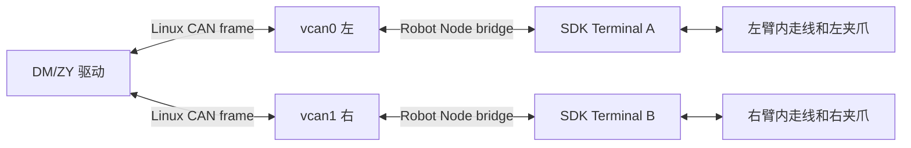
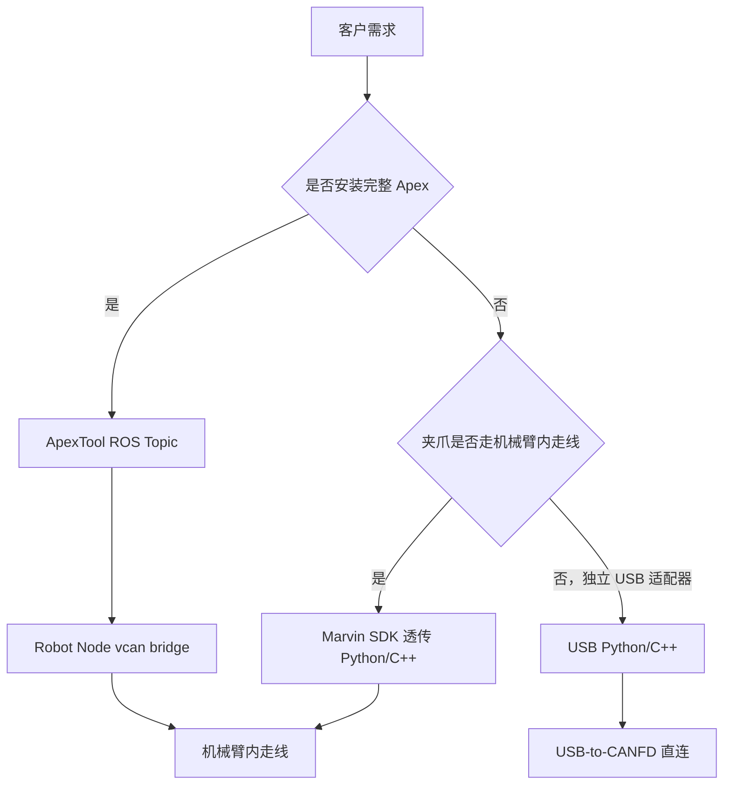

# ApexTool 末端夹爪使用与二次开发

> 文档用途：面向使用 Apex 系统的客户、末端执行器二次开发人员及技术支持人员。
>
> 适用范围：OmniGripper（DM）、智元夹爪（ZY）以及 ApexTool 的标准 ROS 2 接入链路。
>
> 文档日期：2026-08-07

:::note ROS 2 命名空间

当前 Marvin Pro 与 Gento 标准交付默认使用 `/tj` 命名空间，因此本文接口写作 `/tj/control/...` 和 `/tj/info/...`。旧版独立 Tool 包可能仍使用不带 `/tj` 前缀的根路径，应以目标机 `ros2 topic list -t` 和 `ros2 service list -t` 为准。

:::

## 1. 文档目标

本文说明以下内容：

1. ApexTool 在 Apex 系统中的作用及与 Robot、Teleop 模块的关系。
2. DM、ZY 夹爪的安装、选择、启动、控制、反馈和复位方法。
3. 从 ROS Topic 到物理夹爪的完整通信链路。
4. 客户自定义输入设备或上层程序的接入方式。
5. 没有完整 Apex 遥操系统时，如何选择机械臂透传、USB 或独立 ROS 示例。
6. 常见故障的定位步骤及交付检查项。

本文不将 Wuji 灵巧手作为标准夹爪二开接口。部分 ApexTool 版本中包含 Wuji 启动入口，但其设备序列号、手型配置和控制 Topic 与 DM/ZY 不同，应以对应版本的灵巧手交付包为准。

## 2. ApexTool 是什么

`kernelmind-apex-tool` 是 Apex 系统中的独立末端执行器软件包。它负责：

- 根据 `APEX_TOOL_TYPE` 选择末端类型。
- 启动对应的 DM、ZY 或其他末端驱动。
- 提供统一的夹爪命令 Topic、反馈 Topic 和复位 Service。
- 将 ROS 夹爪命令转换为 CAN 帧并写入 `vcan0/vcan1`。
- 从 `vcan0/vcan1` 接收末端返回帧并发布 ROS 反馈。

ApexTool 与核心 Apex 包分开发布，但安装版本必须匹配。已核对的发行包使用如下关系：

```text
kernelmind-apex-tool <版本>
    依赖 kernelmind-apex (= 完全相同版本)
```

因此不建议把不同版本的主包和 Tool 包混装。

### 2.1 模块关系


### 2.2 ApexTool 与其他模块的边界

| 模块 | 主要职责 | 是否直接控制夹爪电机 |
| --- | --- | --- |
| Apex Backend/UI | 页面、状态管理、启动和停止系统服务 | 否 |
| Teleop | 将头显或操作者输入转换为夹爪目标 | 否 |
| ApexTool | 将夹爪目标转换为厂商协议 CAN 帧，解析反馈 | 是，负责协议和控制参数 |
| Robot Node | 在本地 `vcan` 与控制器末端通道之间双向转发 | 不解析电机协议 |
| Marvin/Gento SDK | 与机器人控制器通信，传输末端通道数据 | 不负责 ROS 夹爪逻辑 |

## 3. 先选择正确的接入路线

不同硬件条件应使用不同示例。选错路线时，即使程序能够启动，也可能无法接通物理夹爪。

| 客户条件 | 推荐方式 | 是否需要 ROS | 是否需要 Apex Robot Node | 物理通道 |
| --- | --- | --- | --- | --- |
| 已安装完整 Apex 系统 | ApexTool | 是 | 是 | `vcan` 经 Robot Node 转到机械臂内走线 |
| 只购买机械臂和夹爪，夹爪走机械臂内走线 | Marvin SDK 末端透传例程 | 否，可自行封装 | 否 | SDK Terminal A/B |
| 只测试单独夹爪，有 USB-to-CANFD 适配器 | USB Python/C++ 例程 | 否 | 否 | USB-to-CANFD 直连夹爪 |
| 自研 ROS 系统，但已自行实现末端通道桥 | 独立 ROS 驱动 | 是 | 使用客户自己的桥 | 客户桥接的 SocketCAN 接口 |

关键判断：

- 夹爪通过机械臂内走线连接时，优先使用 ApexTool 或机械臂 SDK 末端透传。
- USB 例程要求把夹爪接到独立 USB-to-CANFD 适配器，不能直接访问机械臂内走线。
- 独立 ROS 例程中的 `vcan0/vcan1` 不是物理 CAN 口。没有 Robot Node 或客户自研桥接程序时，空 `vcan` 只会在本机环回。

## 4. 安装与版本确认

### 4.1 平台要求

根据当前产品配置选择对应安装包：

| 控制器 | Ubuntu | ROS 2 | 安装包架构 |
| --- | --- | --- | --- |
| Orin / 天准 | 22.04 | Humble | `arm64` |
| 灵境 Thor | 24.04 | Jazzy | `arm64` |

不要在 ARM64 控制器上安装 `amd64` 包，也不要混用 Humble 和 Jazzy 构建。

### 4.2 查看已安装版本

```bash
dpkg-query -W kernelmind-apex kernelmind-apex-tool
```

预期两个包均存在，且版本号完全一致。

确认 ROS 包路径：

```bash
source /etc/apex/apex_ros_env.sh
ros2 pkg prefix apex_tool
ros2 pkg prefix dm_gripper_py
ros2 pkg prefix zy_gripper_py
```

正常发行版通常安装到：

```text
/opt/kernelmind/apex/install/
```

### 4.3 安装发行包

使用与主 Apex 包版本、ROS 版本和 CPU 架构匹配的 Tool 包：

```bash
sudo apt install ./kernelmind-apex_<version>_<ros>_arm64.deb \
                 ./kernelmind-apex-tool_<version>_<ros>_arm64.deb
```

安装后执行：

```bash
sudo systemctl daemon-reload
dpkg-query -W kernelmind-apex kernelmind-apex-tool
```

## 5. 末端类型配置

Apex 服务统一读取：

```text
/etc/apex/apex.env
```

标准配置项：

```bash
APEX_TOOL_TYPE=dm
```

当前标准选项：

| 值 | 含义 | 建议 |
| --- | --- | --- |
| `dm` | OmniGripper / 达妙电机夹爪 | 标准支持 |
| `zy` | 智元夹爪 | 标准支持 |
| `none` | 不启动末端节点 | 无夹爪或客户完全自研时使用 |
| `wuji` | Wuji 灵巧手入口 | 仅按指定版本和项目配置使用 |

修改方式：

```bash
sudoedit /etc/apex/apex.env
```

修改后重启 Tool 服务：

```bash
sudo systemctl restart apex-tool.service
```

不要同时启动 DM 和 ZY 节点。两个节点会订阅同一组命令 Topic、注册同名复位 Service，并同时访问 `vcan0/vcan1`。

## 6. 启动、停止与日志

### 6.1 推荐方式：systemd 服务

```bash
sudo systemctl start apex-tool.service
sudo systemctl stop apex-tool.service
sudo systemctl restart apex-tool.service
systemctl status apex-tool.service --no-pager
```

查看实时日志：

```bash
journalctl -u apex-tool.service -f
```

查看最近 200 行：

```bash
journalctl -u apex-tool.service -n 200 --no-pager
```

### 6.2 手动启动

调试时先停止服务，避免重复节点：

```bash
sudo systemctl stop apex-tool.service
source /etc/apex/apex_ros_env.sh
```

通过统一入口启动 DM：

```bash
ros2 launch apex_tool tool.launch.py tool_type:=dm
```

通过统一入口启动 ZY：

```bash
ros2 launch apex_tool tool.launch.py tool_type:=zy
```

也可以直接启动底层包：

```bash
ros2 launch dm_gripper_py dm_gripper.launch.py
```

```bash
ros2 launch zy_gripper_py zy_gripper.launch.py
```

手动调试完成后结束节点，再恢复服务管理：

```bash
sudo systemctl start apex-tool.service
```

## 7. 标准 ROS 接口

运行 ROS 命令前先加载统一环境：

```bash
source /etc/apex/apex_ros_env.sh
```

### 7.1 命令 Topic

| Topic | 类型 | 方向 | 数据含义 |
| --- | --- | --- | --- |
| `/tj/control/gripperValueL` | `std_msgs/msg/Float32` | 客户程序 -> Tool | 左夹爪归一化目标值 |
| `/tj/control/gripperValueR` | `std_msgs/msg/Float32` | 客户程序 -> Tool | 右夹爪归一化目标值 |

输入值会被限制在 `0.0` 到 `1.0`，再由驱动映射到对应夹爪的实际位置范围。

不同夹爪驱动可能包含方向转换，因此不能只凭数值认定 `0` 一定是开、`1` 一定是合。首次接入应在无物体、低风险姿态下分别发送 `0.2` 和 `0.8`，确认实际方向。

单次测试命令：

```bash
ros2 topic pub --once /tj/control/gripperValueL \
  std_msgs/msg/Float32 "{data: 0.2}"
```

```bash
ros2 topic pub --once /tj/control/gripperValueR \
  std_msgs/msg/Float32 "{data: 0.2}"
```

确认方向后再发送另一端点：

```bash
ros2 topic pub --once /tj/control/gripperValueL \
  std_msgs/msg/Float32 "{data: 0.8}"
```

```bash
ros2 topic pub --once /tj/control/gripperValueR \
  std_msgs/msg/Float32 "{data: 0.8}"
```

### 7.2 通用反馈 Topic

| Topic | 类型 | 内容 |
| --- | --- | --- |
| `/tj/info/gripper_feedback_L` | `std_msgs/msg/Float32MultiArray` | 左夹爪反馈 |
| `/tj/info/gripper_feedback_R` | `std_msgs/msg/Float32MultiArray` | 右夹爪反馈 |
| `/tj/info/gripper_feedback_L_err` | `std_msgs/msg/Int32MultiArray` | 左夹爪错误码 |
| `/tj/info/gripper_feedback_R_err` | `std_msgs/msg/Int32MultiArray` | 右夹爪错误码 |

读取反馈：

```bash
ros2 topic echo /tj/info/gripper_feedback_L
ros2 topic echo /tj/info/gripper_feedback_R
```

读取频率：

```bash
ros2 topic hz /tj/info/gripper_feedback_L
ros2 topic hz /tj/info/gripper_feedback_R
```

注意：ROS Topic 发布频率不等于物理 CAN 每一帧都已更新。驱动可能按定时器发布最近一次缓存值。需要严格评估实时性时，应同时检查 CAN 接收时间戳、反馈变化和系统负载。

### 7.3 ZY 状态 Topic

ZY 驱动另外发布：

| Topic | 类型 | 内容 |
| --- | --- | --- |
| `/tj/info/gripper_state_L` | `std_msgs/msg/Int32MultiArray` | 左夹爪状态 |
| `/tj/info/gripper_state_R` | `std_msgs/msg/Int32MultiArray` | 右夹爪状态 |

当前 ZY 状态定义：

| 状态值 | 含义 |
| --- | --- |
| `0` | 到位或静止 |
| `1` | 运动中 |
| `2` | 夹持或堵转 |
| `3` | 物体掉落 |

当前 ZY 错误码定义：

| 错误码 | 含义 |
| --- | --- |
| `0` | 正常 |
| `1` | 过温 |
| `2` | 超速 |
| `3` | 初始化失败 |
| `4` | 超限 |

### 7.4 复位 Service

DM 和 ZY 都提供：

| Service | 类型 | 作用 |
| --- | --- | --- |
| `/tj/control/reset_grippers` | `std_srvs/srv/Trigger` | 左右夹爪 disable 后重新 enable |

调用命令：

```bash
ros2 service call /tj/control/reset_grippers std_srvs/srv/Trigger "{}"
```

该操作适合排查低概率上使能状态异常。复位前确保夹爪周围无人且无易损物体。

## 8. 完整通信链路

### 8.1 命令下行

```text
头显扳机 / 客户输入设备 / 自定义 ROS 节点
    -> /tj/control/gripperValueL 或 /tj/control/gripperValueR
    -> ApexTool 中的 DM/ZY 驱动
    -> 归一化值限幅和实际位置映射
    -> 厂商 CAN 协议打包
    -> vcan0（左）或 vcan1（右）
    -> Robot Node 读取 SocketCAN 帧
    -> Marvin/Gento SDK 末端通道 A/B
    -> 机器人控制器
    -> 机械臂内走线
    -> 物理夹爪
```

### 8.2 反馈上行

```text
物理夹爪反馈帧
    -> 机械臂内走线
    -> 机器人控制器末端通道
    -> Marvin/Gento SDK 读取 A/B 通道
    -> Robot Node 写回 vcan0/vcan1
    -> ApexTool 解析位置、速度、力矩/力、温度、状态或错误码
    -> /tj/info/gripper_feedback_*
    -> 客户程序、UI 或数据采集模块
```

### 8.3 `vcan0/vcan1` 为什么能连接外部夹爪

Linux 中的 `vcan` 本身是虚拟 CAN 接口，不会自动连接物理设备。在 Apex 中，它被用作 Tool 驱动与 Robot Node 之间的本机软件总线：



因此：

- `vcan0/vcan1` 存在，只能证明软件接口已创建。
- `vcan` 上有发送帧，只能证明 Tool 驱动正在发命令。
- 物理夹爪能够动作并返回反馈，才能证明 Robot Node、SDK、控制器、内走线和电机整条链路正常。

### 8.4 Pro 与 Gento 的差异

| 产品体系 | Robot Node 底层 | Tool 侧接口 | 客户上层接口 |
| --- | --- | --- | --- |
| Marvin Pro | Marvin SDK 的末端通道 A/B | `vcan0/vcan1` | 标准 ROS Topic 不变 |
| Gento（Skye/Luna） | Gento SDK 的 L1 Terminal/末端通道 | `vcan0/vcan1` | 标准 ROS Topic 不变 |

客户通过 `/tj/control/gripperValueL/R` 二开时，通常不需要关心底层是 Marvin 还是 Gento。只有在定位 Robot Node、SDK 或物理链路故障时，才需要区分产品体系。

## 9. DM / OmniGripper 驱动说明

### 9.1 默认参数

当前源码的常用默认值：

| 参数 | 左夹爪 | 右夹爪 |
| --- | --- | --- |
| CAN 接口 | `vcan0` | `vcan1` |
| 电机 ID | `1` | `2` |
| 位置最小值 | `0.0` | `0.0` |
| 位置最大值 | `1.6` | `1.6` |
| 自动标定 | `false` | `false` |

归一化位置映射：

```text
实际目标位置 = 输入值 * (max_pos - min_pos) + min_pos
```

### 9.2 MIT 控制参数

DM 驱动在控制定时器中调用 MIT 控制：

```python
controlMIT(motor, kp, kd, target_position, target_velocity, target_torque)
```

当前源码常用值为：

```text
Kp = 3.0
Kd = 0.12
```

Kp/Kd 直接影响夹爪刚度、响应和抖动。修改前应先排除：

- 电机没有正确上使能。
- 左右电机 ID 或 CAN 通道错误。
- 控制目标不连续。
- 多个程序同时发命令。
- 供电压降或末端板通信异常。
- 反馈丢帧导致控制状态不完整。

Kp/Kd 当前不是标准 ROS 动态参数。若客户确需修改，应基于对应版本源码构建定制 Tool 包并完成夹持力、温升、抖动和长时间稳定性验证，不建议直接修改系统安装目录中的 Python 文件。

### 9.3 DM 反馈数组

`/tj/info/gripper_feedback_L/R` 当前字段顺序：

| 索引 | 内容 |
| --- | --- |
| `0` | 位置 |
| `1` | 速度 |
| `2` | 力矩 |
| `3` | MOS 温度 |
| `4` | 电机温度 |

错误 Topic 的第一个元素为驱动解析出的电机错误码。

### 9.4 控制频率

部分源码中控制定时器为 `0.001 s`，名义目标为 1000 Hz；现场稳定版本也可能按项目调整为更低频率。Python 定时器、ROS 调度、SDK 转发和物理总线都不是硬实时系统，因此不能把定时器配置值直接当作稳定实测频率。

若客户要求“在稳定前提下的最大频率”，应在同一硬件和软件版本上持续测量：

- 命令 Topic 频率和抖动。
- 反馈 Topic 频率和消息间隔标准差。
- CAN 反馈的新鲜度。
- 左右夹爪同步动作时的丢帧率。
- 夹爪抖动、温升和到位误差。

## 10. ZY 夹爪驱动说明

### 10.1 默认参数

| 参数 | 左夹爪 | 右夹爪 |
| --- | --- | --- |
| CAN 接口 | `vcan0` | `vcan1` |
| 电机 ID | `8` | `9` |
| 位置范围 | `0.0` 到 `1.0` | `0.0` 到 `1.0` |
| 速度比例 | `100%` | `100%` |
| 加速度比例 | `100%` | `100%` |
| 减速度比例 | `100%` | `100%` |
| 电流限制 | `10000` | `10000` |

ZY 驱动内部会根据电机方向做位置换算，客户应以实机确认后的开合方向为准。

### 10.2 ZY 命令帧

当前驱动使用 8 字节控制帧，主要内容为：

```text
[控制字, 位置, 速度, 力/电流限制, 加速度, 减速度, 保留, 保留]
```

速度、加速度和减速度比例会映射到协议的 `0..255` 范围。

### 10.3 ZY 反馈兼容

为保持与 DM 上层接口一致，ZY 的反馈也发布为 `Float32MultiArray`。当前常用字段为：

```text
[位置, 速度, 力, 0.0, 0.0]
```

温度字段在该兼容数组中不代表真实温度，应结合 ZY 专用状态和错误 Topic 判断设备状态。

## 11. 客户自定义 ROS 输入

### 11.1 接入原则

客户不需要修改 Teleop，可以直接编写 ROS 2 发布节点向以下 Topic 发布：

```text
/tj/control/gripperValueL
/tj/control/gripperValueR
```

接入前必须确认没有其他控制源持续发布：

```bash
ros2 topic info /tj/control/gripperValueL -v
ros2 topic info /tj/control/gripperValueR -v
```

同一 Topic 存在多个发布者时，夹爪会按消息到达顺序执行不同目标，表现为抖动、目标无法到达或左右互相干扰。

### 11.2 最小 Python 发布示例

```python
import rclpy
from rclpy.node import Node
from std_msgs.msg import Float32


class GripperPublisher(Node):
    def __init__(self):
        super().__init__('customer_gripper_publisher')
        self.left_pub = self.create_publisher(
            Float32, '/tj/control/gripperValueL', 10)
        self.right_pub = self.create_publisher(
            Float32, '/tj/control/gripperValueR', 10)

    def send(self, left, right):
        left_msg = Float32()
        right_msg = Float32()
        left_msg.data = float(max(0.0, min(1.0, left)))
        right_msg.data = float(max(0.0, min(1.0, right)))
        self.left_pub.publish(left_msg)
        self.right_pub.publish(right_msg)


def main():
    rclpy.init()
    node = GripperPublisher()
    node.send(0.2, 0.2)
    rclpy.spin_once(node, timeout_sec=0.2)
    node.destroy_node()
    rclpy.shutdown()


if __name__ == '__main__':
    main()
```

### 11.3 从另一台电脑发布

远程 ROS 2 发布端需要满足：

1. ROS 2 发行版和消息类型可兼容。
2. 与控制器使用相同的 `ROS_DOMAIN_ID`。
3. 网络允许 DDS 发现和通信。
4. `ROS_LOCALHOST_ONLY` 不能把通信限制在本机。
5. 发布端已加载正确 ROS 环境。

在 Apex 控制器上查看：

```bash
source /etc/apex/apex_ros_env.sh
echo "$ROS_DOMAIN_ID"
echo "$ROS_LOCALHOST_ONLY"
```

二开程序推荐把左右目标放在同一节点、同一控制循环内发布，不要为左右夹爪分别建立互不协调的高频进程。

## 12. 独立 OmniGripper Control Examples

官方示例仓库：

[KLMmotion/KernalMind-OmniGripper-Control-Examples](https://github.com/KLMmotion/KernalMind-OmniGripper-Control-Examples)

该仓库用于独立验证和客户二次开发，主要包含 USB、机械臂 SDK 透传和 ROS 三类示例。

### 12.1 示例总览

| 示例 | 仓库目录 | 适用场景 | 是否依赖 Apex |
| --- | --- | --- | --- |
| USB Python | `USB_Gripper/u2canfdpy` | 单独夹爪台架、快速验证 | 否 |
| USB C++ | `USB_Gripper/u2canfdC++` | C++ 工程、低层 USB/CANFD 接入 | 否 |
| Marvin SDK Python 透传 | `Marvin_Gripper/.../SDK_PYTHON` | 夹爪走机械臂内走线，Python 二开 | 否 |
| Marvin SDK C++ 透传 | `Marvin_Gripper/.../SDK_C++/u2can` | 夹爪走机械臂内走线，C++ 二开 | 否 |
| DM ROS 2 | `DMROS_gripper-main` | 已有 ROS 2 和末端通道桥 | 取决于桥接实现 |
| ZY ROS 2 | `ZYROS_gripper-main/zy_gripper_py` | 智元夹爪 ROS 2 二开 | 取决于桥接实现 |

### 12.2 USB Python 例程

通信链路：

```text
Python 程序
    -> pyusb
    -> USB-to-CANFD 适配器
    -> 物理 CANFD 线
    -> DM 夹爪电机
```

特点：

- 不经过机械臂、机器人控制器、Marvin SDK 或 ROS 2。
- 适合判断夹爪电机、适配器、CAN 参数和电机 ID 是否正常。
- 需要识别 USB 设备序列号，并在例程配置中填写。
- 示例包含 `dev_sn.py` 用于读取适配器序列号。
- 常用总线配置为仲裁段 1 Mbps、数据段 5 Mbps。
- 多设备高速通信时，应按硬件说明检查总线末端 120 欧姆终端电阻。

USB 设备权限规则使用适配器实际的 Vendor ID 和 Product ID。仓库当前示例对应：

```text
Vendor ID: 34b7
Product ID: 6877
```

首次运行顺序：

```bash
cd USB_Gripper/u2canfdpy
python3 dev_sn.py
```

将读取到的序列号填入示例配置后，再运行对应控制程序。具体文件名和依赖以仓库当前 README 为准。

### 12.3 USB C++ 例程

通信链路与 USB Python 相同，但使用 C++ 和 `libusb`：

```text
C++ 程序 -> libusb -> USB-to-CANFD -> DM 电机
```

适合：

- 客户主程序为 C++。
- 需要自行封装设备发现、CANFD 发送和反馈接收。
- 需要在台架上独立验证夹爪，不希望引入 ROS 2。

典型构建流程：

```bash
cd USB_Gripper/u2canfdC++
mkdir -p build
cd build
cmake ..
make -j
```

构建器版本、`libusb` 版本和可执行文件名称以仓库 README 为准。

### 12.4 Marvin SDK Python 透传例程

适用条件：

- 客户购买了 Marvin/天机机械臂与夹爪。
- 夹爪通过机械臂内走线安装。
- 客户没有部署完整 Apex 遥操系统。

通信链路：

```text
客户 Python 程序
    -> Marvin SDK
    -> OnSetChDataA/B
    -> 机器人控制器末端通道
    -> 机械臂内走线
    -> 左右夹爪

夹爪反馈
    -> OnGetChDataA/B
    -> 客户 Python 程序
```

关键接口：

| 接口 | 作用 |
| --- | --- |
| `OnSetChDataA` | 向 A 末端通道发送数据 |
| `OnSetChDataB` | 向 B 末端通道发送数据 |
| `OnGetChDataA` | 读取 A 末端通道反馈 |
| `OnGetChDataB` | 读取 B 末端通道反馈 |

仓库中的 `KM_gripper.py` 提供了基本运动示例。使用前必须把机器人 IP 修改为实际控制器 IP。README 中出现的 `192.168.10.190` 只是示例值，不代表所有设备都使用该地址。

此方式不要求客户另配带 CAN 的主控制器，因为末端 CAN 数据通过机械臂控制器和内走线透传。但要求：

- 机械臂控制器支持并正确配置末端通道。
- 夹爪接线、电源和电机 ID 正确。
- Marvin SDK 与控制器固件版本兼容。
- 客户程序能够稳定维护 SDK 连接并读取返回数据。

### 12.5 Marvin SDK C++ 透传例程

C++ 版本使用同一组末端通道接口。仓库示例包括：

```text
test_damiao.cpp
eef_can_demo.cpp
```

适合把机械臂控制和夹爪控制集成到同一个 C++ 进程。推荐采用：

1. 一个 SDK 连接统一管理机械臂和末端通道。
2. 同一控制循环内按固定顺序下发机械臂命令和夹爪帧。
3. 接收过程持续读取机械臂和末端反馈，避免只发不收。
4. 不使用长时间阻塞式 `sleep` 阻塞全部控制。
5. 对 SDK 调用进行串行化，避免多个线程同时访问非线程安全接口。

### 12.6 DM ROS 2 例程

`DMROS_gripper-main` 与 ApexTool 中的 DM 驱动接口基本一致：

```text
/tj/control/gripperValueL/R
    -> DM ROS 节点
    -> vcan0/vcan1
```

它适合已有 ROS 2 系统的客户，但必须回答一个问题：谁负责把 `vcan0/vcan1` 转发到物理末端？

- 完整 Apex 系统：Robot Node 负责桥接。
- 客户自研系统：客户需要实现 SocketCAN 与 Marvin/Gento SDK Terminal 的双向桥。
- 只有本机空 `vcan`：程序可能启动，但物理夹爪不会动作。

出现以下报错时：

```text
OSError: [Errno 19] No such device
```

说明程序绑定的 `vcan0` 或 `vcan1` 不存在。创建接口只能解决 `bind()` 报错，不能替代真实的末端桥接。

### 12.7 ZY ROS 2 例程

ZY ROS 2 示例采用与 ApexTool 相同的标准命令接口，适合客户在自有 ROS 2 系统中接入智元夹爪。除协议和电机 ID 不同外，其 `vcan` 物理链路要求与 DM 相同。

首次接入需重点确认：

- 左右电机 ID 是否为项目约定值。
- 左右 `vcan` 与机械臂末端通道映射是否正确。
- 位置方向是否符合客户设备安装方向。
- ZY 状态与错误 Topic 是否持续更新。

### 12.8 独立例程与 ApexTool 的关系



独立示例主要用于展示底层能力和帮助客户二开，不代表所有示例可以同时运行。

## 13. 并发与资源占用要求

### 13.1 不允许同时运行的组合

- `apex-tool.service` 与手动启动的 DM/ZY 节点。
- DM 节点与 ZY 节点。
- Apex Robot Node 已持有机器人 SDK 连接时，再启动独立 Marvin SDK 透传程序。
- Teleop 持续发布夹爪命令时，客户程序同时发布同名 Topic。
- 两个独立程序同时读写同一 USB-to-CANFD 设备。

### 13.2 推荐的控制所有权

| 场景 | 唯一控制所有者 |
| --- | --- |
| 完整 Apex 遥操 | Teleop/回放/客户 ROS 节点三者选一作为当前命令源 |
| 客户 ROS 二开 | 客户发布节点，停止其他持续发布源 |
| SDK 透传二开 | 客户单一 SDK 进程 |
| USB 台架测试 | 单一 USB 示例程序 |

多个命令源是双夹爪抖动、相互干扰和无法到位的首要排查项之一。

## 14. 安全测试流程

1. 确认急停有效，夹爪周围无人员和易损物体。
2. 核对夹爪类型、电机 ID、左右接线和软件版本。
3. 启动 Robot 模块，确认 Robot Node 正常连接控制器。
4. 启动 ApexTool，确认没有进程退出和共享库报错。
5. 确认标准 Topic 与复位 Service 存在。
6. 先读取反馈，不带负载测试单侧夹爪。
7. 使用 `0.2`、`0.8` 确认方向，不直接从一个极限跳到另一个极限。
8. 分别测试左、右，再测试双侧同步。
9. 观察错误码、温度、位置误差和供电状态。
10. 最后在低速、轻负载条件下接入客户上层程序。

## 15. 快速自检命令

### 15.1 服务和进程

```bash
systemctl status apex-tool.service --no-pager
systemctl list-units 'apex-*' --no-pager
ros2 node list
```

### 15.2 配置

```bash
grep -E 'APEX_TOOL_TYPE|APEX_ROBOT_PLATFORM|APEX_ROBOT_MODEL|ROS_DOMAIN_ID' \
  /etc/apex/apex.env
```

### 15.3 ROS 接口

```bash
ros2 topic list | grep -E 'gripper|gripperValue'
ros2 service list | grep reset_grippers
ros2 topic info /tj/control/gripperValueL -v
ros2 topic info /tj/control/gripperValueR -v
```

### 15.4 `vcan`

```bash
ip -details -statistics link show vcan0
ip -details -statistics link show vcan1
```

如已安装 `can-utils`：

```bash
candump vcan0
candump vcan1
```

### 15.5 反馈

```bash
ros2 topic echo /tj/info/gripper_feedback_L --once
ros2 topic echo /tj/info/gripper_feedback_R --once
ros2 topic echo /tj/info/gripper_feedback_L_err --once
ros2 topic echo /tj/info/gripper_feedback_R_err --once
```

## 16. 常见问题

### 16.1 `ros2 launch` 提示找不到包

先检查环境和安装：

```bash
source /etc/apex/apex_ros_env.sh
ros2 pkg prefix apex_tool
ros2 pkg prefix dm_gripper_py
ros2 pkg prefix zy_gripper_py
```

若找不到，核对 `kernelmind-apex-tool` 是否安装、是否为当前 ROS 发行版、是否与主包同版本。

### 16.2 提示 executable not found

这通常表示只复制了 `share` 或源码目录，没有复制已构建的可执行安装内容。不要把单个目录直接粘贴到 `/opt/kernelmind/apex/install` 充当安装。应安装完整 `.deb`，或在源码工作区执行标准 `colcon build` 后加载生成的 `install/setup.bash`。

### 16.3 `No such device`，绑定 `vcan0` 失败

检查：

```bash
ip link show vcan0
ip link show vcan1
```

如果完整 Apex 系统中接口不存在，优先检查 Robot Node 的启动和安装配置。不要把“手工创建空 vcan”作为最终修复。

### 16.4 Topic 有命令，但夹爪不动

按以下顺序排查：

```text
命令 Topic 是否变化
-> Tool 节点是否订阅
-> vcan 是否有发送帧
-> Robot Node 是否运行
-> SDK 是否连接机器人控制器
-> 末端通道是否启用
-> 内走线和末端板是否正常
-> 夹爪是否上电、使能、ID 正确
```

### 16.5 一侧能动，另一侧不动

重点检查：

- 左右 `vcan0/vcan1` 是否都有帧。
- 左右电机 ID 是否与驱动配置一致。
- 左右末端通道 A/B 是否接反。
- 不动作侧是否上电、上使能。
- 错误 Topic 是否有报错。
- 末端板、线束或供电是否异常。

### 16.6 能动但没有反馈

说明命令下行可能正常，但反馈上行不完整。检查：

- 驱动是否调用接收函数。
- Robot Node 是否将 SDK `OnGetChDataA/B` 返回写回 `vcan0/vcan1`。
- 电机主从 ID和返回 ID 是否配置正确。
- `candump` 是否能看到返回帧。
- Topic 是否发布的是缓存值而非新反馈。

### 16.7 夹爪抖动或无法到位

优先排查：

1. 同一命令 Topic 是否有多个发布者。
2. 左右夹爪是否由两个独立 SDK 进程同时控制。
3. 命令是否跳变，是否缺少限速和平滑。
4. 控制循环是否被阻塞，实际间隔是否稳定。
5. 双夹爪同时运动时是否出现供电压降。
6. 电机 ID、反馈帧和左右通道是否串扰。
7. DM 的 Kp/Kd 是否与负载和机构匹配。

### 16.8 低概率上使能后刚度异常

先调用：

```bash
ros2 service call /tj/control/reset_grippers std_srvs/srv/Trigger "{}"
```

若复位后恢复，优先怀疑初始化或使能时序。若不能恢复，再检查错误码、反馈、末端板、供电和电机自身状态，不应直接通过不断提高 Kp/Kd 处理。

### 16.9 远程电脑看不到 Topic

检查两端：

```bash
echo "$ROS_DOMAIN_ID"
echo "$ROS_LOCALHOST_ONLY"
```

两端 `ROS_DOMAIN_ID` 必须一致，并确认防火墙、网卡和 DDS 配置允许跨机发现。

## 17. 二次开发交付清单

交付或联调前记录：

| 项目 | 记录内容 |
| --- | --- |
| 机器人主体 | Pro / Skye / Luna |
| 机械臂构型 | M6 696 / M6 Lite / M3 / 其他 |
| 控制器 | Orin / 天准 / 灵境 Thor |
| Ubuntu / ROS | 22.04 Humble / 24.04 Jazzy |
| 末端类型 | DM / ZY / Wuji / 无 |
| `kernelmind-apex` 版本 |  |
| `kernelmind-apex-tool` 版本 |  |
| Marvin/Gento SDK 版本 |  |
| Robot IP |  |
| `ROS_DOMAIN_ID` |  |
| 左右电机 ID |  |
| 命令源 | Teleop / 回放 / 客户 ROS / SDK / USB |
| 左右单独测试 | 通过 / 不通过 |
| 左右同步测试 | 通过 / 不通过 |
| 反馈和错误码 | 正常 / 异常 |
| 长时间测试 | 时长、频率、负载和结果 |

## 18. 客户支持边界建议

### 18.1 使用完整 Apex 系统

可以支持到：

- Tool 包安装与版本匹配。
- 标准 ROS Topic、反馈和 Service。
- Robot Node 到末端通道的桥接排查。
- DM/ZY 标准配置和问题定位。

### 18.2 只购买机械臂和夹爪

建议客户使用官方 Marvin SDK 透传示例。可以支持到：

- SDK 末端通道接口说明。
- 标准 CAN 数据格式和示例。
- 电机 ID、接线、供电和基本控制验证。

客户自研控制框架中的线程调度、实时性、命令融合和多进程资源冲突，需要由客户根据自身架构负责。

### 18.3 只购买夹爪或台架测试

建议使用 USB Python/C++ 示例。需要客户具备：

- 兼容的 USB-to-CANFD 适配器。
- 正确的物理接线、供电和终端电阻。
- 与示例一致的电机型号、ID、波特率和控制模式。

## 19. 一页速查

```bash
# 1. 加载环境
source /etc/apex/apex_ros_env.sh

# 2. 查看配置和版本
grep APEX_TOOL_TYPE /etc/apex/apex.env
dpkg-query -W kernelmind-apex kernelmind-apex-tool

# 3. 启动并查看日志
sudo systemctl restart apex-tool.service
systemctl status apex-tool.service --no-pager
journalctl -u apex-tool.service -n 100 --no-pager

# 4. 查看接口
ros2 topic list | grep -E 'gripper|gripperValue'
ros2 service list | grep reset_grippers

# 5. 确认发布者数量
ros2 topic info /tj/control/gripperValueL -v
ros2 topic info /tj/control/gripperValueR -v

# 6. 低幅度测试
ros2 topic pub --once /tj/control/gripperValueL std_msgs/msg/Float32 "{data: 0.2}"
ros2 topic pub --once /tj/control/gripperValueR std_msgs/msg/Float32 "{data: 0.2}"

# 7. 查看反馈
ros2 topic echo /tj/info/gripper_feedback_L --once
ros2 topic echo /tj/info/gripper_feedback_R --once

# 8. 复位夹爪
ros2 service call /tj/control/reset_grippers std_srvs/srv/Trigger "{}"

# 9. 检查软件 CAN 端点
ip -details -statistics link show vcan0
ip -details -statistics link show vcan1
```

## 20. 参考资料

- 官方独立示例：[KLMmotion/KernalMind-OmniGripper-Control-Examples](https://github.com/KLMmotion/KernalMind-OmniGripper-Control-Examples)
- ApexTool 发行包内的 `apex_tool`、`dm_gripper_py`、`zy_gripper_py` README 和 launch 配置。
- 实际交付时，以客户设备所安装版本的参数、接口和发行说明为准。
