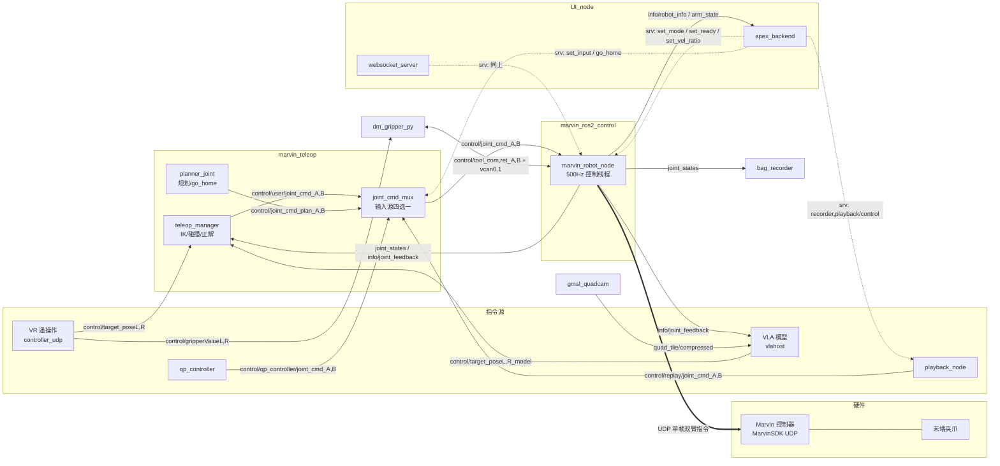

# Apex ROS2 接口文档（Topics & API）

按模块整理系统全部 ROS topic 与 service。QoS 缩写说明：

| 缩写 | 实际配置 |
|---|---|
| `SensorData` | best_effort, keep_last(5), volatile（`rclcpp::SensorDataQoS` / `qos_profile_sensor_data`） |
| `Reliable(N)` | reliable, keep_last(N)（depth 数字直接给出，如 `10`） |
| `BestEffort(1)` | best_effort, keep_last(1) |
| `Latched` | reliable, transient_local, keep_last(1)（后加入的订阅者会收到最后一条） |

## 系统结构

---

## 1. marvin_ros2_control（marvin_robot_node）

机器人驱动层，系统唯一直接与机械臂控制器通信的节点。内部单控制线程按 `control_rate`（默认 200Hz，上限 ~1000Hz）循环：读状态 → 发关节指令（SDK 批量接口，双臂单帧、不等回执）→ 发布反馈。

### Topics

| Name | Type | QoS | 方向 | Detail |
|---|---|---|---|---|
| `control/joint_cmd_A` | `marvin_msgs/msg/JointcmdArm` | BestEffort(1) | Sub | 左臂 7 关节位置目标（rad）。带时间戳校验：晚于 0.1s 的消息丢弃。每控制周期取最新一条下发 |
| `control/joint_cmd_B` | `marvin_msgs/msg/JointcmdArm` | BestEffort(1) | Sub | 右臂，同上 |
| `joint_states` | `sensor_msgs/msg/JointState` | Reliable(10) | Pub | 14 关节位置/速度/力矩（rad），按 `joint_states_rate`（默认 100Hz）降频发布 |
| `info/joint_feedback` | `marvin_msgs/msg/Jointfeedback` | SensorData | Pub | 双臂 14 关节反馈，控制周期同频（高频），供 IK/VLA 等低延迟消费者 |
| `info/arm_state` | `std_msgs/msg/Int16MultiArray` | Reliable(10) | Pub | [stateA, stateB] 手臂状态机；未 ready 时为 -1 |
| `info/robot_state` | `std_msgs/msg/Int16MultiArray` | Reliable(10) | Pub | 同 `info/arm_state`（兼容别名，同一消息） |
| `info/robot_info` | `marvin_msgs/msg/RobotInfo` | Reliable(10) | Pub | 机型（pro/skye/luna）与控制器版本，默认每 5s 发布一次 |
| `info/flange_force_left/right` | `geometry_msgs/msg/WrenchStamped` | SensorData | Pub | 末端法兰估计力（当前代码中已注释停用） |

### Services

| Name | Type | Detail |
|---|---|---|
| `control/set_mode` | `marvin_msgs/srv/Int` | 0=下使能 1=位置模式 3=关节阻抗。要求手臂低速静止；在控制线程上执行 |
| `control/set_ready` | `std_srvs/srv/Trigger` | 置 ready 标志，之后才接受关节指令流 |
| `control/set_drag` | `marvin_msgs/srv/Int` | 0=退出拖动 1=关节拖动 |
| `control/set_vel_ratio` | `marvin_msgs/srv/Int` | 0/1/2/3 → 速度加速度百分比 30/50/80/100，仅 idle 态可调。**注意：PD 模式（ff_mode 速度前馈流式控制）下不生效** —— 该限速只作用于控制器内部的规划运动，流式下发的目标点由 PD+前馈直接跟踪，不受 vel/acc ratio 限制 |
| `control/clear_fault` | `std_srvs/srv/Trigger` | 清除控制器/伺服错误 |
| `control/get_motor_err_code` | `marvin_msgs/srv/MotorErrCode` | 读取 14 个伺服错误码 |

### 硬件侧（非 ROS）

- MarvinSDK UDP ↔ 控制器（192.168.1.190）：指令经 `OnClearSet → OnSetJointCmdPos_A/B → OnSetSend` 单帧下发，SDK 内部 1ms 定时器收发
- `vcan0`/`vcan1` SocketCAN ↔ SDK 末端工具通道（`OnGet/SetChDataA/B`）桥接线程，供夹爪通信

---

## 2. marvin_teleop

遥操作链路：VR 输入（`controller_udp.py`）→ IK/碰撞检测（`teleop_manager_node`）→ 指令多路复用（`joint_cmd_mux`）。

### joint_cmd_mux（指令收敛点）

四路指令源选一路转发；切源时做 `ramp_duration_sec`（默认 3s）的平滑过渡。

| Name | Type | QoS | 方向 | Detail |
|---|---|---|---|---|
| `control/qp_controller/joint_cmd_A/B` | `marvin_msgs/msg/JointcmdArm` | SensorData | Sub | 输入源 1：QP 全身控制器 |
| `control/joint_cmd_plan_A/B` | `marvin_msgs/msg/Jointcmd` | SensorData | Sub | 输入源 2：关节规划器（go_home/movej） |
| `control/user/joint_cmd_A/B` | `marvin_msgs/msg/JointcmdArm` | SensorData | Sub | 输入源 3：遥操作 IK 输出（默认源） |
| `control/replay/joint_cmd_A/B` | `marvin_msgs/msg/JointcmdArm` | SensorData | Sub | 输入源 4：录制回放 |
| `joint_states` | `sensor_msgs/msg/JointState` | SensorData | Sub | 当前关节位置，用于切源平滑起点 |
| `control/joint_cmd_A/B` | `marvin_msgs/msg/JointcmdArm` | SensorData | Pub | 选中源的输出 → marvin_robot_node |
| `control/input_mode` | `std_msgs/msg/Int32` | Latched | Pub | 当前输入源编号（1=qp 2=plan 3=user 4=replay） |

Service：`control/set_input`（`marvin_msgs/srv/Int`）切换输入源。

### teleop_manager_node（IK / 正解 / 碰撞）

| Name | Type | QoS | 方向 | Detail |
|---|---|---|---|---|
| `control/target_poseL/R` | `geometry_msgs/msg/PoseStamped` | SensorData | Sub | 左/右末端目标位姿（VR 或模型发布） |
| `control/enableL/R` | `std_msgs/msg/Bool` | SensorData | Sub | 遥操作使能（VR 扳机死区开关） |
| `info/joint_feedback` | `marvin_msgs/msg/Jointfeedback` | SensorData | Sub | 高频关节反馈，IK 种子与正解输入 |
| `info/vr_connected` | `std_msgs/msg/Bool` | Reliable(10) | Sub | VR 连接状态 |
| `control/user/joint_cmd_A/B`* | `marvin_msgs/msg/JointcmdArm` | SensorData | Pub | IK 解算出的关节指令 → mux |
| `control/eef_cmd_A/B` | `geometry_msgs/msg/PoseStamped` | SensorData | Pub | 实际下发的末端指令位姿（限幅/滤波后） |
| `control/ik_cmd_A/B` | `marvin_msgs/msg/Jointcmd` | SensorData | Pub | IK 原始解（调试用） |
| `control/ik_request` | `marvin_msgs/msg/IKRequest` | SensorData | Pub | IK 请求记录（调试/记录用） |
| `info/eef_left/right` | `geometry_msgs/msg/PoseStamped` | Reliable(10) | Pub | 正解末端位姿（供 VR 对齐、VLA 观测） |
| `info/wrench_left/right` | `geometry_msgs/msg/WrenchStamped` | SensorData | Pub | 末端估计力/力矩 |
| `joint_states` | `sensor_msgs/msg/JointState` | Reliable(10) | Pub | 仿真/独立模式下的关节状态 |
| `right_arm/eef_pose` | `geometry_msgs/msg/PoseStamped` | SensorData | Pub | 右臂末端位姿（兼容旧接口） |

### controller_udp.py（VR 手柄接入）

| Name | Type | QoS | 方向 | Detail |
|---|---|---|---|---|
| `control/target_poseL/R` | `PoseStamped` | SensorData | Pub | VR 手柄映射的末端目标 |
| `control/gripperValueL/R` | `std_msgs/msg/Float32` | Reliable(10) | Pub | 夹爪开合值 0~1（扳机） |
| `control/enableL/R` | `std_msgs/msg/Bool` | SensorData | Pub | 使能开关 |
| `control/Elbow_left/right` | `PoseStamped` | SensorData | Pub | 肘部跟踪目标（冗余自由度约束） |
| `control/accept_user_joint_cmd` | `std_msgs/msg/Bool` | Reliable(10) | Pub | 是否接受用户指令标志 |
| `info/vr_connected` | `std_msgs/msg/Bool` | Reliable(10) | Pub | VR 心跳/连接状态 |
| `control/footkey` | `std_msgs/msg/Int32` | Reliable(10) | Sub/Pub | 脚踏板按键（`footpad_reader.py` 发布） |
| `info/eef_left/right` | `PoseStamped` | SensorData | Sub | 正解位姿，VR 端对齐用 |

### planner_joint_node（规划器）

| Name | Type | QoS | 方向 | Detail |
|---|---|---|---|---|
| `control/joint_cmd_plan_A/B` | `marvin_msgs/msg/Jointcmd` | SensorData | Pub | 规划轨迹逐点输出 → mux |
| `info/joint_feedback` | `marvin_msgs/msg/Jointfeedback` | SensorData | Sub | 规划起点 |

Services：`control/go_home`（`std_srvs/srv/Trigger`，规划回 home 位）、`control/movej`（`marvin_msgs/srv/MoveJ`，关节空间点到点）。

---

## 3. marvin_qp_controller

| Name | Type | QoS | 方向 | Detail |
|---|---|---|---|---|
| `control/qp_controller/joint_cmd_A/B` | `marvin_msgs/msg/JointcmdArm` | SensorData | Pub | QP 优化输出的关节指令 → mux |
| `info/robot_state` | `std_msgs/msg/Int16MultiArray` | Reliable(10) | Sub | 手臂状态，决定是否输出 |

---

## 4. vlahost（VLA 模型推理）

Topic 名均为 ROS 参数，下表为默认值。

| Name（默认） | Type | QoS | 方向 | Detail |
|---|---|---|---|---|
| `quad_tile/compressed` | `sensor_msgs/msg/CompressedImage` | SensorData | Sub | 四目相机拼接图，模型视觉观测 |
| `/info/joint_feedback` | `marvin_msgs/msg/Jointfeedback` | SensorData | Sub | 关节观测 |
| `/info/eef_left/right` | `PoseStamped` | SensorData | Sub | 末端位姿观测 |
| `/control/target_poseL/R_model` | `PoseStamped` | SensorData | Pub | 模型输出的末端目标（与 VR 的 target_pose 分流，便于切换/混合） |
| `control/gripperValueL/R` | `std_msgs/msg/Float32` | Reliable(10) | Pub | 模型输出的夹爪指令 |
| eef_constraint（参数名 `eef_constraint_topic`） | — | — | Pub | 末端约束输出 |

---

## 5. dm_gripper_py（达妙夹爪）

| Name | Type | QoS | 方向 | Detail |
|---|---|---|---|---|
| `/control/gripperValueL/R` | `std_msgs/msg/Float32` | Reliable(10) | Sub | 夹爪开合目标 0~1 |
| `control/tool_com_A/B` | `std_msgs/msg/UInt16MultiArray` | Reliable(10) | Pub | 发往末端 CAN 通道的原始帧（经 robot_node 的 vcan 桥 → SDK） |
| `control/tool_ret_A/B` | `std_msgs/msg/UInt16MultiArray` | Reliable(10) | Sub | 末端 CAN 通道返回帧 |
| `info/gripper_feedback_L/R` | `std_msgs/msg/Float32MultiArray` | Reliable(10) | Pub | 夹爪位置/力反馈 |
| `info/gripper_feedback_L/R_err` | `std_msgs/msg/Int32MultiArray` | Reliable(5) | Pub | 夹爪电机错误码 |

Service：`control/reset_grippers`（`std_srvs/srv/Trigger`）夹爪电机复位。

---

## 6. gmsl_quadcam_cpp（四目相机）

| Name | Type | QoS | 方向 | Detail |
|---|---|---|---|---|
| `quad_tile/compressed` | `sensor_msgs/msg/CompressedImage` | SensorData | Pub | 四路 GMSL 相机 2x2 拼接 JPEG 流 |

Service：`recorder/set_recording`（`marvin_msgs/srv/VideoCapture`）开始/停止视频落盘录制。

---

## 7. recording_playback（录制/回放）

### bag_recorder（录制）

| Name | Type | QoS | 方向 | Detail |
|---|---|---|---|---|
| `/recorder/status` | `std_msgs/msg/Int32` | Reliable(10) | Pub | 录制状态机 |

Services：`recorder/control`（`marvin_msgs/srv/JsonCommand`，JSON 指令：start/stop/任务名等，bag 存储路径按用户派生）；作为 client 调 `recorder/set_recording` 联动视频录制。

### playback_node（回放）

| Name | Type | QoS | 方向 | Detail |
|---|---|---|---|---|
| `control/replay/joint_cmd_A/B` | `marvin_msgs/msg/JointcmdArm` | Reliable(10) | Pub | 回放的关节指令流 → mux（需先 `set_input` 切到 replay 源） |
| `control/gripperValueL/R` | `std_msgs/msg/Float32` | Reliable(10) | Pub | 回放的夹爪指令 |
| `hand_left/right/joint_commands_playback` | `sensor_msgs/msg/JointState` | Reliable(10) | Pub | 灵巧手回放指令 |
| `/playback_status` | `std_msgs/msg/String` | Reliable(10) | Pub | 回放状态（JSON 文本） |
| `/playback_key` | `std_msgs/msg/Bool` | Latched | Pub | 回放关键帧标志 |
| `joint_states` | `sensor_msgs/msg/JointState` | Reliable(10) | Sub | 回放前校验当前位置与轨迹起点偏差 |
| `control/playback_control` | `std_msgs/msg/String` | Reliable(10) | Sub | 文本控制通道（兼容） |

Service：`playback/control`（`marvin_msgs/srv/JsonCommand`）load/play/pause/stop。

---

## 8. UI_node（后端 API 层）

`apex_backend`（HTTP/业务后端）、`marvin_websocket_server`（前端 WebSocket 桥）、`robot_setting`（设置页服务）均为 **service 客户端**，不直接发指令 topic：

| 调用的 Service | Type | 用途 |
|---|---|---|
| `/control/set_mode` | `marvin_msgs/srv/Int` | 切控制模式 |
| `/control/set_ready` | `std_srvs/srv/Trigger` | 使能指令流 |
| `/control/set_vel_ratio` | `marvin_msgs/srv/Int` | 调速（PD 前馈模式下不生效，见模块 1） |
| `/control/go_home` | `std_srvs/srv/Trigger` | 回 home |
| `/control/set_input` | `marvin_msgs/srv/Int` | 切 mux 输入源 |
| `/control/reset_grippers` | `std_srvs/srv/Trigger` | 夹爪复位 |
| `recorder/control`、`playback/control` | `marvin_msgs/srv/JsonCommand` | 录制/回放控制 |

订阅（状态展示）：`/info/robot_info`、`/info/arm_state`、`/playback_status`、`/control/input_mode`（Latched）。

---

## 附：marvin_msgs 消息/服务清单

- **msg**：`Jointcmd`（单臂 7 关节）、`JointcmdArm`（带 header 的单臂指令）、`JointcmdBody/Head/Lift`、`Jointfeedback`（14 关节反馈）、`IKRequest`/`IKResult`、`RobotInfo`、`VrBody`/`VrController`、`Collimarker`
- **srv**：`Int`（通用整型指令）、`JsonCommand`（JSON 字符串指令）、`MotorErrCode`、`MoveJ`、`Velratio`、`VideoCapture`

> 生成于 2026-07-04，基于 devel 分支 `8beab88`。QoS 与类型均提取自各节点源码中的 `create_publisher/subscription/service` 调用。
