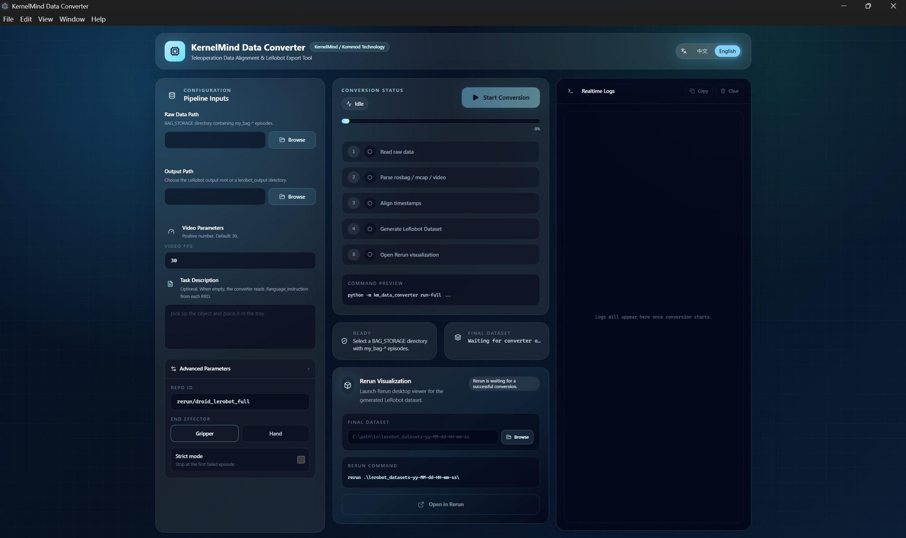
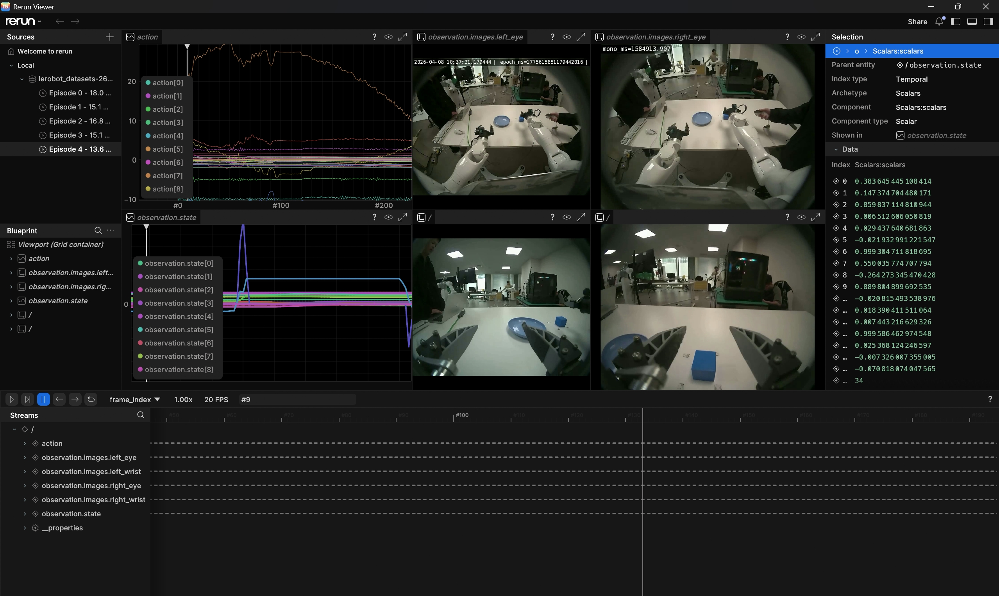

# KM Data Converter

A conversion toolchain for robot imitation-learning datasets. It automatically organizes, aligns, and exports MCAP data and four-channel camera videos from the raw acquisition directory `BAG_STORAGE` into a LeRobot v3.0 dataset.

- One-click conversion from raw acquisition data to LeRobot v3.0 datasets
- Supports splitting 2x2 tiled camera videos, with left eye, right eye, left wrist, and right wrist views by default
- Exports MCAP robot state data to RRD and aligns it with video frames
- Provides an Electron desktop UI for selecting paths, setting FPS, entering task descriptions, and viewing real-time logs
- Supports viewing converted datasets and robot state in Rerun

## Conversion Flow

```text
BAG_STORAGE raw data
  -> split four-channel camera video
  -> export MCAP to RRD
  -> align video and robot state
  -> export LeRobot dataset
  -> inspect with Rerun visualization
```

Each episode directory must use the following structure:

```text
BAG_STORAGE/
  my_bag-yy-MM-dd-HH-mm-ss/
    data/
      data_0.mcap
    video/
      cameras.mp4
      cameras_first_frame.yaml
```

The default `cameras.mp4` layout is:

```text
left_eye      right_eye
left_wrist    right_wrist
```

## Environment Setup

Python 3.10 to 3.12 is recommended.

```powershell
pip install -e .
pip install rerun-sdk[all]
pip install -e .\examples\python\rerun_export
```

If video or YAML dependencies are missing, install them additionally:

```powershell
pip install opencv-python pyyaml
```

## Use the Desktop UI

The project includes an Electron UI, suitable for daily conversion work.



```powershell
cd .\km_data_converter_UI
npm install
npm run dev
```

In the UI, select the `BAG_STORAGE` source directory and output directory, set target FPS, task description, and advanced options, then start the full conversion flow. The UI displays progress, real-time logs, the final dataset path, and provides a button to open the conversion result in Rerun.



## Command-Line Conversion

After placing all acquisition directories under `BAG_STORAGE`, run:

```powershell
python -m km_data_converter run-full
```

You can also pass explicit input and output paths:

```powershell
python -m km_data_converter run-full <bag_storage_path> [output_root_path]
```

Common parameter example:

```powershell
python -m km_data_converter run-full ^
  --bag-storage BAG_STORAGE ^
  --target-fps 10 ^
  --output-dir OUTPUT_DIR ^
  --repo-id rerun/droid_lerobot_full ^
  --end-effector {gripper,hand} ^
  --task-description TASK_DESCRIPTION ^
  --strict
```

The default output directory structure is:

```text
datasets/
  mcap2rrd/
  video2rrd/
  lerobot_output/
```

The final LeRobot dataset usually contains directories such as `data`, `meta`, and `videos`.

## Run Step by Step

For debugging or running only one stage, use the step-by-step commands.

Split tiled videos:

```powershell
python -m km_data_converter split-video
```

Convert MCAP to RRD:

```powershell
python -m km_data_converter mcap-to-rrd ^
  --bag-storage .\BAG_STORAGE ^
  --output-dir .\datasets\mcap2rrd
```

Write video and robot state into a new RRD:

```powershell
python -m km_data_converter video-to-rrd ^
  --bag-storage .\BAG_STORAGE ^
  --dataset-dir .\datasets\mcap2rrd ^
  --output-dir .\datasets\video2rrd
```

Export the LeRobot dataset:

```powershell
python -m km_data_converter rrd-to-lerobot ^
  --input-dir .\datasets\video2rrd ^
  --output-root .\datasets\lerobot_output\lerobot_datasets
```

To override the task description for all frames, pass a fixed text:

```powershell
python -m km_data_converter rrd-to-lerobot ^
  --input-dir .\datasets\video2rrd ^
  --output-root .\datasets\lerobot_output\lerobot_datasets ^
  --task-description TASK_DESCRIPTION
```

## Main Commands

| Command | Purpose |
| --- | --- |
| `python -m km_data_converter run-full` | Run the full conversion flow |
| `python -m km_data_converter split-video` | Split `cameras.mp4` into four camera videos |
| `python -m km_data_converter mcap-to-rrd` | Export `mcap2rrd.rrd` for each episode |
| `python -m km_data_converter video-to-rrd` | Align video and robot state and generate `video2rrd` |
| `python -m km_data_converter rrd-to-lerobot` | Merge multiple RRD files and export a LeRobot dataset |

## Data Fields

### Action

The `action` vector has 56 dimensions in a fixed order:

```text
action = [effort(14), position(14), velocity(14), control_A(7), control_B(7)]
```

Where:

- 0-13: joint torque `/joint_states/effort`
- 14-27: joint position `/joint_states/position`
- 28-41: joint velocity `/joint_states/velocity`
- 42-48: left arm control command `/control/joint_cmd_A`
- 49-55: right arm control command `/control/joint_cmd_B`

### Observation State

The `observation.state` vector has 26 dimensions in a fixed order:

```text
observation.state = [eef_left(7), eef_right(7), gripper_feedback_L(6), gripper_feedback_R(6)]
```

Where:

- `eef_left`: 7D left end-effector pose
- `eef_right`: 7D right end-effector pose
- `gripper_feedback_L`: 6D left gripper feedback
- `gripper_feedback_R`: 6D right gripper feedback

The end-effector pose field order is:

```text
pose.position.x, pose.position.y, pose.position.z,
pose.orientation.x, pose.orientation.y, pose.orientation.z, pose.orientation.w
```

## Marvin_pro URDF

To append the Marvin URDF and aligned joint transforms to an existing `video2rrd` file, run:

```powershell
python -m km_data_converter.urdf ^
  --input-rrd .\datasets\video2rrd\video2rrd-yy-MM-dd-HH-mm-ss.rrd ^
  --output-rrd .\datasets\video2rrd\video2rrd-yy-MM-dd-HH-mm-ss-with-urdf.rrd ^
  --no-spawn
```

Common parameters:

- `--input-rrd`: the `video2rrd` file to enhance
- `--output-rrd`: output RRD path; if omitted, `-with-urdf.rrd` is generated next to the original file
- `--xacro`: optional xacro file path; defaults to the Marvin M6 model in the repository
- `--output-urdf`: optional expanded URDF output path
- `--no-spawn`: do not automatically open the Rerun viewer

## Rerun Visualization

Install Rerun:

```powershell
pip install rerun-sdk[all]
```

Enter `datasets\lerobot_output` and open the dataset:

```powershell
rerun .\lerobot_datasets-yy-MM-dd-HH-mm-ss\
```

Replace `yy-MM-dd-HH-mm-ss` with the actual generated dataset timestamp directory.

## Notes

- Episode directory names must start with `my_bag-yy-MM-dd-HH-mm-ss`
- `video-to-rrd` requires all four split camera videos to exist
- `video-to-rrd` generates sensor dashboard videos under each episode's `video` directory
- By default, scripts skip abnormal episodes and continue processing; with `--strict`, processing stops on the first error
- Converting new data may overwrite old intermediate results under `datasets`; save any RRD or dataset that must be kept
- Before converting a new batch of data, clean up or replace old acquisition directories in `BAG_STORAGE`
