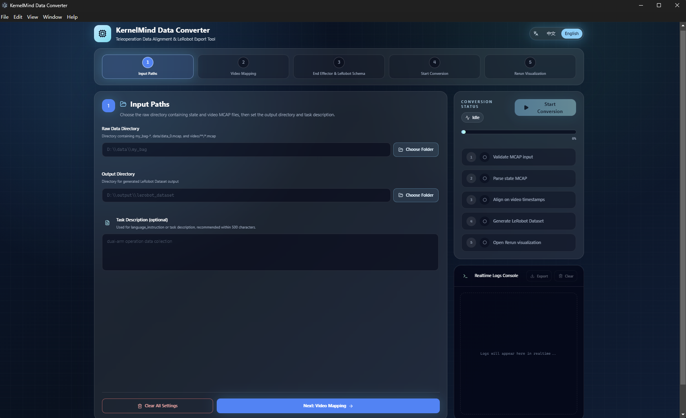
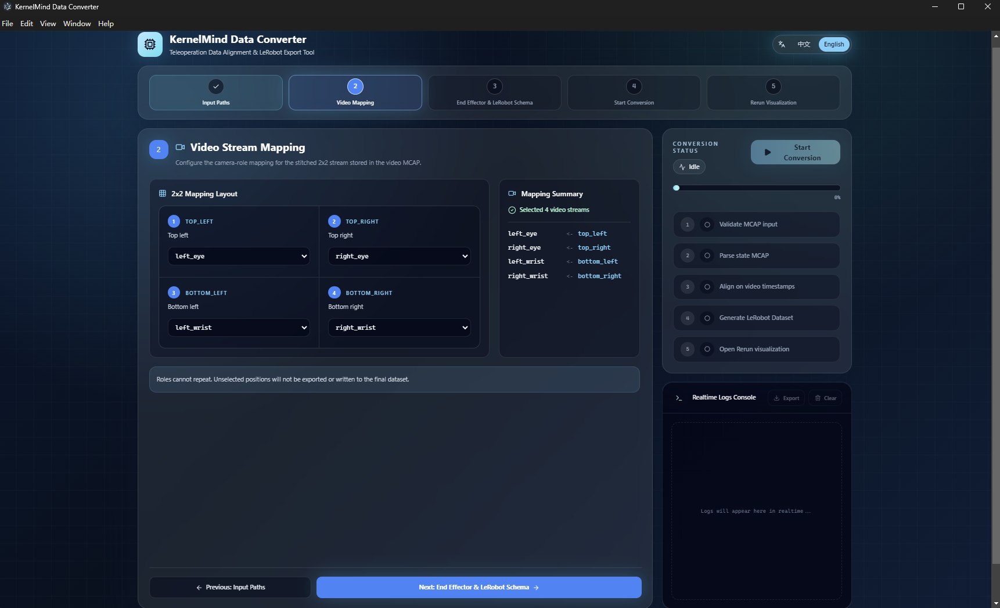
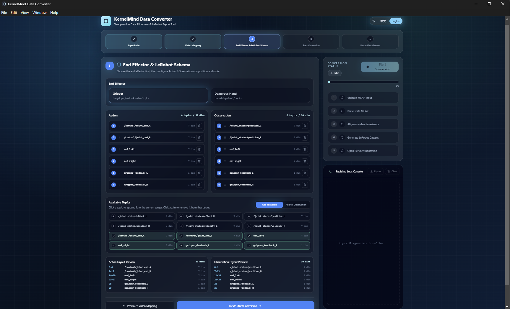
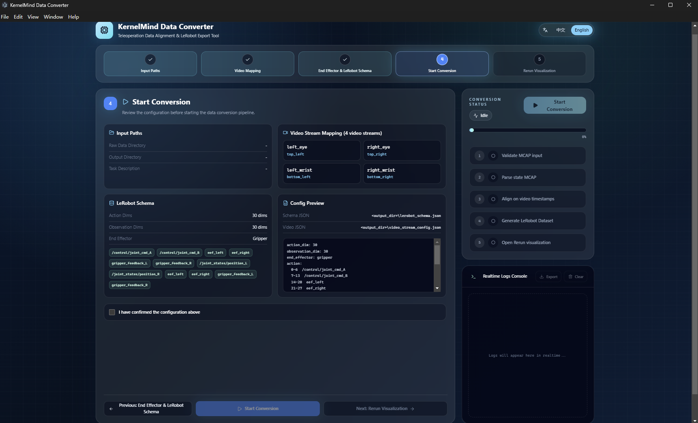

# Data-Processing-Tool Guide

Data-Processing-Tool is a Windows desktop application for Apex teleoperation datasets. It validates dual-MCAP recordings, configures video streams and robot fields, and exports LeRobot v3 datasets. The Windows `.exe` installer includes the required runtime, so customers do not need to install Python, Conda, or Node.js.

Repository: [Gento-Teleoperation-Apex/Data-Processing-Tool](https://github.com/Gento-Teleoperation-Apex/Data-Processing-Tool)

## 1. Download and Install

1. Open the repository [Releases](https://github.com/Gento-Teleoperation-Apex/Data-Processing-Tool/releases) page.
2. Download the latest Windows x64 installer, such as `Data-Processing-Tools-<version>-Setup.exe`.
3. Run the installer and follow the prompts, then launch Data-Processing-Tool from the desktop or Start menu.

:::note Windows security notice
Early releases may not be code-signed. If Windows displays an unknown-publisher warning, first verify that the installer came from the official repository above, then select **More info** to continue.
:::

## 2. Dual-MCAP Input Format

Each episode must contain both a state MCAP and a video MCAP:

```text
BAG_STORAGE/
  recorded_bags/
    my_bag-yy-MM-dd-HH-mm-ss/
      data/
        data_0.mcap
      video/
        record_<timestamp>/
          record_<timestamp>_0.mcap
```

| File | Purpose | Requirement |
|---|---|---|
| `data/data_0.mcap` | Arm state, action, and end-effector data | One per episode |
| `video/**/*.mcap` | 2x2 camera video streams | Exactly one per episode |

The new format no longer uses `cameras.mp4` or `cameras_first_frame.yaml`. The video MCAP `log_time` is the primary video timeline. Robot states are aligned to video frames by absolute timestamp while preserving the native frame rate and all recorded frames.

## 3. Conversion Workflow

### 3.1 Select Input and Output Directories

Select the directory that contains one or more `my_bag-*` episodes, then choose the LeRobot dataset output directory. The task description is optional, but a concise description of the recorded task is recommended.



### 3.2 Configure Video Stream Mapping

Map each position in the 2x2 video frame to its camera role:

- `left_eye`: left eye camera
- `right_eye`: right eye camera
- `left_wrist`: left wrist camera
- `right_wrist`: right wrist camera

Use the actual frame positions. Each role must be assigned only once.



### 3.3 Select the End Effector and Schema

Select the installed end-effector type, then verify the Action and Observation topics, order, and dimensions. Grippers and dexterous hands use different fields, so this configuration must match both the recording and the downstream training configuration.



### 3.4 Review and Start Conversion

Review the input path, video mapping, end-effector type, and Schema. Confirm the settings and start conversion. The status panel reports the current stage, progress, and live logs for input validation, MCAP parsing, timestamp alignment, and dataset generation.



### 3.5 Inspect the Rerun Visualization

After conversion, open the Rerun visualization and verify that all four camera streams, robot states, actions, and end-effector data are aligned correctly on the timeline.


## 4. Data Quality Check

Data-Processing-Tool also includes a data-quality module. Before converting a large batch, verify that:

- every episode contains both a state MCAP and exactly one video MCAP;
- all required topics exist and contain a reasonable number of messages;
- timestamps are continuous and state data covers the video time range;
- all four camera views are complete and mapped to the correct physical cameras;
- Action, Observation, and end-effector dimensions match the training configuration.

Quality checking and conversion cannot run at the same time. Wait for the active task to finish, or stop it before switching modules.

## 5. Output Layout

The output directory contains:

```text
<output>/
  lerobot_schema.json
  video_stream_config.json
  mcap2rrd/
  video2rrd/
  lerobot_output/
    lerobot_datasets-<timestamp>/
      data/
      meta/
        stats.json
      videos/
```

- `lerobot_schema.json`: Action and Observation field configuration used for this conversion.
- `video_stream_config.json`: mapping between 2x2 frame positions and camera roles.
- `mcap2rrd/` and `video2rrd/`: Rerun visualization data.
- `lerobot_output/`: final LeRobot v3 dataset.

## 6. Troubleshooting

**No episodes are detected**

Verify that the selected directory directly contains `my_bag-*` directories and that every episode has both `data/data_0.mcap` and exactly one `video/**/*.mcap`.

**The video MCAP count is invalid**

Only one `.mcap` file is allowed under each episode's `video/` directory. Move duplicate recordings or backups elsewhere and run the check again.

**Conversion succeeds but camera positions are wrong**

Return to **Video Stream Mapping** and remap `left_eye`, `right_eye`, `left_wrist`, and `right_wrist` according to the original 2x2 frame.

**Timestamp alignment or field-dimension errors occur**

Run the data-quality check, then verify the state MCAP time range, end-effector selection, and Action/Observation Schema. Include the software version, a screenshot of the input layout, and the live log when reporting an issue.
