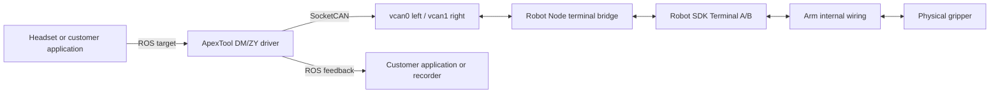

# ApexTool Gripper Usage and Integration

> Audience: Apex customers, end-effector developers, and technical-support engineers.
>
> Scope: OmniGripper (DM), ZY grippers, and the standard ApexTool ROS 2 integration path.
>
> Document date: August 7, 2026

:::note ROS 2 namespace

Current Marvin Pro and Gento deliveries use the `/tj` namespace by default, so this page uses `/tj/control/...` and `/tj/info/...`. Older standalone Tool packages may still expose root paths without the `/tj` prefix; use the target machine's `ros2 topic list -t` and `ros2 service list -t` as the source of truth.

:::

## 1. Purpose

This guide explains:

1. The role of ApexTool and its relationship to Robot and Teleop.
2. Installation, selection, startup, control, feedback, and reset for DM and ZY grippers.
3. The complete path from ROS topics to a physical gripper.
4. Integration of customer input devices and applications.
5. USB, robot-SDK passthrough, and standalone ROS examples for systems without the complete Apex stack.
6. Troubleshooting and delivery checks.

Wuji dexterous hands are not treated as a standard gripper-development interface here. Their serial numbers, hand configuration, and control topics depend on the delivered Wuji package.

## 2. What ApexTool Does

`kernelmind-apex-tool` is the end-effector package for Apex. It:

- Selects the end effector using `APEX_TOOL_TYPE`.
- Starts the DM, ZY, or configured end-effector driver.
- Provides common command, feedback, error, and reset interfaces.
- Converts ROS gripper commands to CAN frames on `vcan0/vcan1`.
- Receives return frames and publishes ROS feedback.

The Apex and Tool package versions must match exactly:

```text
kernelmind-apex-tool <version>
    depends on kernelmind-apex (= the same version)
```

### 2.1 Module relationship



| Module | Responsibility | Directly controls motor protocol? |
|---|---|---|
| Apex Backend/UI | Pages, status, and service lifecycle | No |
| Teleop | Converts operator input into gripper targets | No |
| ApexTool | Vendor CAN protocol, control parameters, feedback parsing | Yes |
| Robot Node | Bridges local vCAN and controller terminal channels | No protocol parsing |
| Marvin/Gento SDK | Communicates with the robot controller | No ROS gripper logic |

## 3. Choose the Correct Integration Path

| Customer setup | Recommended path | ROS required? | Apex Robot Node required? | Physical path |
|---|---|---|---|---|
| Complete Apex system | ApexTool | Yes | Yes | vCAN through Robot Node and arm wiring |
| Robot and gripper only, using arm wiring | Marvin SDK terminal passthrough | Optional | No | SDK Terminal A/B |
| Standalone gripper with USB-to-CANFD | USB Python/C++ example | No | No | USB adapter directly to gripper |
| Custom ROS system with its own terminal bridge | Standalone ROS driver | Yes | Customer bridge | Customer SocketCAN bridge |

`vcan0/vcan1` are virtual local interfaces, not physical CAN ports. Without Robot Node or a customer bridge, an empty vCAN interface only loops frames inside Linux.

## 4. Installation and Version Check

| Controller | Ubuntu | ROS 2 | Package architecture |
|---|---|---|---|
| Orin / Tianzhun | 22.04 | Humble | `arm64` |
| Lingjing Thor | 24.04 | Jazzy | `arm64` |

Do not install amd64 packages on arm64 or mix Humble and Jazzy builds.

```bash
dpkg-query -W kernelmind-apex kernelmind-apex-tool
source /etc/apex/apex_ros_env.sh
ros2 pkg prefix apex_tool
ros2 pkg prefix dm_gripper_py
ros2 pkg prefix zy_gripper_py
```

Install matching packages together:

```bash
sudo apt install ./kernelmind-apex_<version>_<ros>_arm64.deb \
                 ./kernelmind-apex-tool_<version>_<ros>_arm64.deb
sudo systemctl daemon-reload
dpkg-query -W kernelmind-apex kernelmind-apex-tool
```

## 5. End-Effector Selection

All Apex services read `/etc/apex/apex.env`:

```bash
APEX_TOOL_TYPE=dm
```

| Value | Meaning | Support |
|---|---|---|
| `dm` | OmniGripper using DM motors | Standard |
| `zy` | ZY gripper | Standard |
| `none` | Do not start an end-effector node | No gripper or fully custom stack |
| `wuji` | Wuji dexterous-hand entry | Project/release-specific |

```bash
sudoedit /etc/apex/apex.env
sudo systemctl restart apex-tool.service
```

Do not run DM and ZY nodes together. They subscribe to the same commands, register the same reset service, and access the same vCAN interfaces.

## 6. Startup, Stop, and Logs

Use systemd for normal operation:

```bash
sudo systemctl start apex-tool.service
sudo systemctl stop apex-tool.service
sudo systemctl restart apex-tool.service
systemctl status apex-tool.service --no-pager
journalctl -u apex-tool.service -f
journalctl -u apex-tool.service -n 200 --no-pager
```

For manual debugging, stop the service first:

```bash
sudo systemctl stop apex-tool.service
source /etc/apex/apex_ros_env.sh
ros2 launch apex_tool tool.launch.py tool_type:=dm
# or
ros2 launch apex_tool tool.launch.py tool_type:=zy
```

The low-level launch files are:

```bash
ros2 launch dm_gripper_py dm_gripper.launch.py
ros2 launch zy_gripper_py zy_gripper.launch.py
```

Stop the manual node before restoring `apex-tool.service`.

## 7. Standard ROS Interfaces

### 7.1 Commands

| Topic | Type | Direction | Meaning |
|---|---|---|---|
| `/tj/control/gripperValueL` | `std_msgs/msg/Float32` | Customer to Tool | Normalized left target |
| `/tj/control/gripperValueR` | `std_msgs/msg/Float32` | Customer to Tool | Normalized right target |

Input is clamped to `0.0-1.0` and mapped to the physical position range. Driver direction may differ, so verify `0.2` and `0.8` without an object before assuming which value opens or closes the gripper.

```bash
ros2 topic pub --once /tj/control/gripperValueL std_msgs/msg/Float32 "{data: 0.2}"
ros2 topic pub --once /tj/control/gripperValueR std_msgs/msg/Float32 "{data: 0.2}"
```

### 7.2 Feedback and errors

| Topic | Type | Meaning |
|---|---|---|
| `/tj/info/gripper_feedback_L` | `std_msgs/msg/Float32MultiArray` | Left feedback |
| `/tj/info/gripper_feedback_R` | `std_msgs/msg/Float32MultiArray` | Right feedback |
| `/tj/info/gripper_feedback_L_err` | `std_msgs/msg/Int32MultiArray` | Left error code |
| `/tj/info/gripper_feedback_R_err` | `std_msgs/msg/Int32MultiArray` | Right error code |

```bash
ros2 topic echo /tj/info/gripper_feedback_L
ros2 topic echo /tj/info/gripper_feedback_R
ros2 topic hz /tj/info/gripper_feedback_L
ros2 topic hz /tj/info/gripper_feedback_R
```

A ROS publication rate does not prove that every physical CAN frame is new. For real-time evaluation, inspect CAN receive timestamps, changing feedback values, and host load as well.

### 7.3 ZY state

| Topic | Type | Meaning |
|---|---|---|
| `/tj/info/gripper_state_L` | `std_msgs/msg/Int32MultiArray` | Left ZY state |
| `/tj/info/gripper_state_R` | `std_msgs/msg/Int32MultiArray` | Right ZY state |

ZY state values are `0` reached/still, `1` moving, `2` gripping/stalled, and `3` object dropped. Common error values are `0` normal, `1` over-temperature, `2` over-speed, `3` initialization failure, and `4` limit exceeded.

### 7.4 Reset

```bash
ros2 service call /tj/control/reset_grippers std_srvs/srv/Trigger "{}"
```

This disables and re-enables both grippers. Keep people and fragile objects clear before calling it.

## 8. Complete Communication Path

```text
Headset trigger / customer device / ROS node
    -> /tj/control/gripperValueL or /tj/control/gripperValueR
    -> ApexTool DM/ZY driver
    -> clamp and position mapping
    -> vendor CAN frame
    -> vcan0 (left) or vcan1 (right)
    -> Robot Node SocketCAN bridge
    -> Marvin/Gento SDK Terminal A/B
    -> robot controller and arm wiring
    -> physical gripper
```

Feedback follows the reverse path and becomes `/tj/info/gripper_feedback_*`. `vcan` existence only proves that the software endpoint exists; physical motion plus fresh feedback proves the complete chain.

| Product | Robot interface | Tool interface | Customer interface |
|---|---|---|---|
| Marvin Pro | Marvin SDK Terminal A/B | `vcan0/vcan1` | Standard ROS topics |
| Gento Skye/Luna | Gento SDK L1 terminal channels | `vcan0/vcan1` | Standard ROS topics |

## 9. DM / OmniGripper Driver

Typical defaults are left `vcan0`, motor ID `1`; right `vcan1`, motor ID `2`; position range `0.0-1.6`; auto calibration disabled.

The current source commonly uses MIT control with approximately `Kp=3.0` and `Kd=0.12`. These values affect stiffness, response, and oscillation. Before changing them, eliminate enable failures, wrong IDs/channels, discontinuous targets, duplicate publishers, power drop, terminal-board faults, and stale feedback.

DM feedback array order is:

| Index | Field |
|---:|---|
| `0` | Position |
| `1` | Velocity |
| `2` | Torque |
| `3` | MOS temperature |
| `4` | Motor temperature |

Kp/Kd are not standard dynamic ROS parameters. Build and validate a release-specific Tool package instead of editing installed Python files directly.

## 10. ZY Gripper Driver

Typical defaults are left `vcan0`, ID `8`; right `vcan1`, ID `9`; normalized range `0.0-1.0`; speed/acceleration/deceleration at 100%; current limit `10000`.

The eight-byte command frame contains control word, position, speed, force/current limit, acceleration, deceleration, and reserved fields. The compatible feedback array is commonly `[position, speed, force, 0.0, 0.0]`; the two final values are not real temperatures. Use ZY-specific state and error topics for device status.

## 11. Customer ROS Input

Customers may publish directly to `/tj/control/gripperValueL/R` without modifying Teleop. First confirm that no other source publishes continuously:

```bash
ros2 topic info /tj/control/gripperValueL -v
ros2 topic info /tj/control/gripperValueR -v
```

Multiple publishers cause alternating targets, oscillation, or failure to settle.

```python
import rclpy
from rclpy.node import Node
from std_msgs.msg import Float32


class GripperPublisher(Node):
    def __init__(self):
        super().__init__('customer_gripper_publisher')
        self.left_pub = self.create_publisher(
            Float32, '/tj/control/gripperValueL', 10)
        self.right_pub = self.create_publisher(
            Float32, '/tj/control/gripperValueR', 10)

    def send(self, left, right):
        left_msg = Float32()
        right_msg = Float32()
        left_msg.data = float(max(0.0, min(1.0, left)))
        right_msg.data = float(max(0.0, min(1.0, right)))
        self.left_pub.publish(left_msg)
        self.right_pub.publish(right_msg)


def main():
    rclpy.init()
    node = GripperPublisher()
    node.send(0.2, 0.2)
    rclpy.spin_once(node, timeout_sec=0.2)
    node.destroy_node()
    rclpy.shutdown()


if __name__ == '__main__':
    main()
```

Remote publishers need compatible ROS messages, the same `ROS_DOMAIN_ID`, working DDS networking, `ROS_LOCALHOST_ONLY` configured for cross-machine communication, and the correct sourced environment.

## 12. Standalone OmniGripper Examples

Official repository: [KLMmotion/KernalMind-OmniGripper-Control-Examples](https://github.com/KLMmotion/KernalMind-OmniGripper-Control-Examples)

| Example | Directory | Use case | Apex dependency |
|---|---|---|---|
| USB Python | `USB_Gripper/u2canfdpy` | Standalone bench test | No |
| USB C++ | `USB_Gripper/u2canfdC++` | C++ USB/CANFD integration | No |
| Marvin SDK Python | `Marvin_Gripper/.../SDK_PYTHON` | Gripper through arm wiring | No |
| Marvin SDK C++ | `Marvin_Gripper/.../SDK_C++/u2can` | C++ terminal passthrough | No |
| DM ROS 2 | `DMROS_gripper-main` | ROS with a terminal bridge | Bridge-dependent |
| ZY ROS 2 | `ZYROS_gripper-main/zy_gripper_py` | ZY ROS integration | Bridge-dependent |

USB examples talk directly to a USB-to-CANFD adapter and do not pass through the robot. SDK examples use `OnSetChDataA/B` and `OnGetChDataA/B` to reach grippers through arm wiring. Standalone ROS examples still require something to bridge `vcan0/vcan1` to the physical terminal channel.

Do not run standalone SDK code while Apex Robot Node owns the same SDK connection.

## 13. Concurrency and Ownership

Do not run these combinations together:

- `apex-tool.service` and a manually launched DM/ZY node.
- DM and ZY nodes.
- Apex Robot Node and an independent Marvin SDK passthrough process.
- Teleop and a customer node continuously publishing the same gripper topic.
- Two programs accessing one USB-to-CANFD adapter.

Use one command owner per test: Teleop, playback, customer ROS, SDK, or USB.

## 14. Safe Test Procedure

1. Verify the emergency stop and clear the gripper workspace.
2. Confirm type, motor IDs, left/right wiring, and software versions.
3. Start Robot and verify the controller connection.
4. Start ApexTool and check for process or library errors.
5. Confirm topics and reset service.
6. Read feedback first; test one side unloaded.
7. Use `0.2` and `0.8` to verify direction without jumping between limits.
8. Test left, right, and then synchronized motion.
9. Monitor errors, temperature, position error, and power.
10. Integrate the customer application last, at low speed and load.

## 15. Quick Diagnostics

```bash
systemctl status apex-tool.service --no-pager
grep -E 'APEX_TOOL_TYPE|APEX_ROBOT_PLATFORM|APEX_ROBOT_MODEL|ROS_DOMAIN_ID' \
  /etc/apex/apex.env
ros2 topic list | grep -E 'gripper|gripperValue'
ros2 service list | grep reset_grippers
ros2 topic info /tj/control/gripperValueL -v
ros2 topic info /tj/control/gripperValueR -v
ip -details -statistics link show vcan0
ip -details -statistics link show vcan1
ros2 topic echo /tj/info/gripper_feedback_L --once
ros2 topic echo /tj/info/gripper_feedback_R --once
ros2 topic echo /tj/info/gripper_feedback_L_err --once
ros2 topic echo /tj/info/gripper_feedback_R_err --once
```

## 16. Common Problems

| Symptom | Checks |
|---|---|
| ROS package not found | Source Apex environment; verify matching Tool package |
| Executable not found | Install complete deb/colcon output, not only `share` |
| `No such device` for `vcan0` | Robot Node and terminal bridge; do not treat empty vCAN as a full fix |
| Command topic changes but no motion | Tool subscriber, vCAN frames, Robot, SDK, terminal channel, power, enable, IDs |
| Only one side moves | vCAN side, ID, Terminal A/B mapping, power, error topic, wiring |
| Motion but no feedback | Receive path, SDK return bridge, IDs, `candump`, cached versus fresh values |
| Oscillation or failure to settle | Duplicate publishers, target jumps, blocked loop, power drop, channel crosstalk, DM gains |
| Abnormal stiffness after enable | Reset first; then inspect initialization, errors, power, and motor state |
| Remote computer cannot see topics | Matching Domain, `ROS_LOCALHOST_ONLY`, firewall, DDS network interface |

## 17. Integration Delivery Checklist

Record robot model, arm configuration, controller, Ubuntu/ROS, end-effector type, Apex and Tool versions, SDK version, robot IP, Domain, motor IDs, command owner, single-side and synchronized results, feedback/errors, and long-duration test conditions.

## 18. Support Boundaries

For a complete Apex system, support covers matching Tool packages, standard ROS interfaces, Robot terminal bridging, and standard DM/ZY configuration. For robot-and-gripper-only systems, use the official SDK passthrough examples. For standalone gripper bench tests, use the USB examples with compatible hardware, wiring, power, termination, IDs, bitrate, and control mode.

Customer-specific schedulers, real-time behavior, command fusion, and multi-process resource ownership remain part of the customer's application architecture.

## 19. One-Page Quick Reference

```bash
source /etc/apex/apex_ros_env.sh
grep APEX_TOOL_TYPE /etc/apex/apex.env
dpkg-query -W kernelmind-apex kernelmind-apex-tool

sudo systemctl restart apex-tool.service
systemctl status apex-tool.service --no-pager
journalctl -u apex-tool.service -n 100 --no-pager

ros2 topic list | grep -E 'gripper|gripperValue'
ros2 service list | grep reset_grippers
ros2 topic info /tj/control/gripperValueL -v
ros2 topic info /tj/control/gripperValueR -v

ros2 topic pub --once /tj/control/gripperValueL std_msgs/msg/Float32 "{data: 0.2}"
ros2 topic pub --once /tj/control/gripperValueR std_msgs/msg/Float32 "{data: 0.2}"

ros2 topic echo /tj/info/gripper_feedback_L --once
ros2 topic echo /tj/info/gripper_feedback_R --once
ros2 service call /tj/control/reset_grippers std_srvs/srv/Trigger "{}"

ip -details -statistics link show vcan0
ip -details -statistics link show vcan1
```

## 20. References

- [KLMmotion/KernalMind-OmniGripper-Control-Examples](https://github.com/KLMmotion/KernalMind-OmniGripper-Control-Examples)
- README files and launch configurations delivered with `apex_tool`, `dm_gripper_py`, and `zy_gripper_py`.
- The parameters, interfaces, and release notes installed on the delivered device are authoritative.
