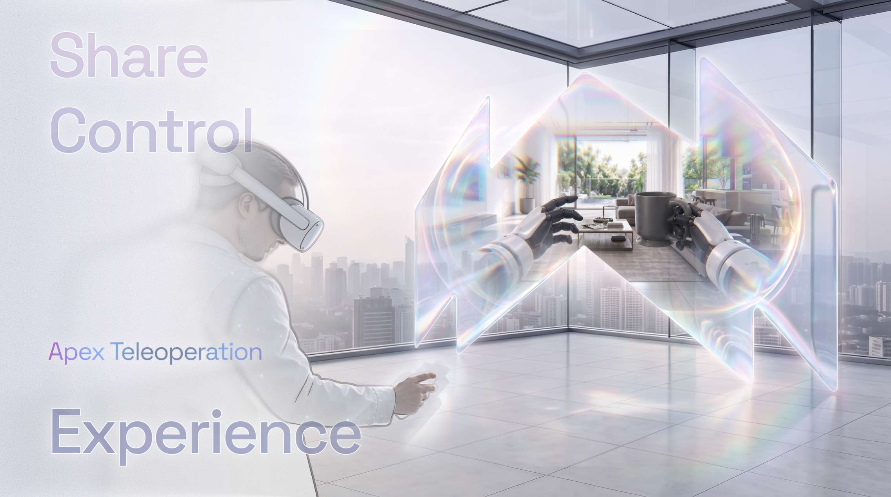

# Apex XR Teleoperation Client User Manual

Welcome to the Teleoperation Client usage guide.

:::warning Wired Headset Connection
Use **Ethernet port 1** when connecting the headset to a Tianzhun controller and **Ethernet port 2** with a Lingjing Thor controller. Both controllers use `6.6.7.100` as the default connection address. Follow the delivered configuration if the site network parameters have been changed.
:::

Please select the manual that corresponds to the headset you are currently using:

* [Meta Quest App Installation](./meta-app-installation.md)
* [Meta Quest User Manual](./meta.md)
* [PICO App Installation](./pico-app-installation.md)
* [PICO User Manual](./pico.md)
* [Privacy Policy](./privacy-policy.md)

---
